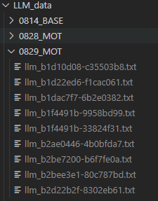

# risk evaluation 交付 上

2023年8月29日

已完成的视频：



- 共9个视频，其中部分有损坏，详见后文

- 用时约4h, 为了平衡input output, batch取的是7 frames, 这样不会超过5200 的toke限制，得到结果效果也不错

## 文件夹内容说明

这次为了方便审阅，以及我意识到我的命名习惯非常烂之后，决定写个文档便于交付

- **输入llm分析数据**: 由目标追踪得到

- **llm 分析结果**‘：LLM直接得到的数据，无降采样
- **每一帧的风险人物**: 各个视频的json处理中间结果，ARHUD组可以考虑用其做动画（不知道效果如何）
- **prompt**: 通过读入文件的方式，方便API加载prompt
- **ARHUD_json**: ZQ组部分需要的json文件，_null 表示直接全局显示，starting +ending表示有开始结束帧
- **mot_chatbot_0829.ipynb**: chatbot的存档，写了几个轮子之后感觉还可以
- 


## problem batch:

运行到一半因为各种各样的原因（Openai服务器）爆掉的batch, 后续会做断点续传，使用请小心

```


 b1d10d08-c35503b8, b1d22ed6-f1cac061, 
 Analyzing video b1f4491b-33824f31 starting from batch 42
### frame 0294
peopl
Analyzing video b1f4491b-33824f31 starting from batch 43
### frame 0301


Analyzing video b1f4491b-9958bd99 starting from batch 44
### frame 0308

Analyzing video b2d22b2f-8302eb61 starting from batch 23
### frame 0161
```

## 未来工作：

- [ ] 跑完所有视频
- [ ] 断点续传视频功能设计
- [ ] 混合帧分析，提升性能
- [x] 检查人，机识别差异
  - [ ] 可以看到，目前还是有比较大的偏差，可能跟prompt有关系，需要多考虑
- [ ] 读点论文，看看人家怎么压缩视频的