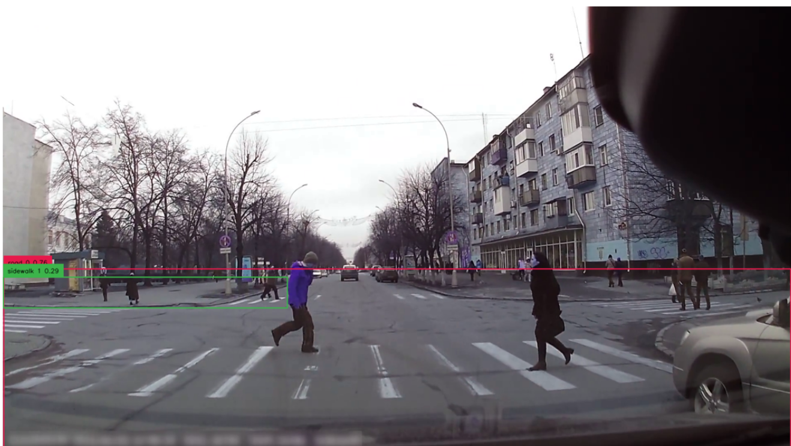
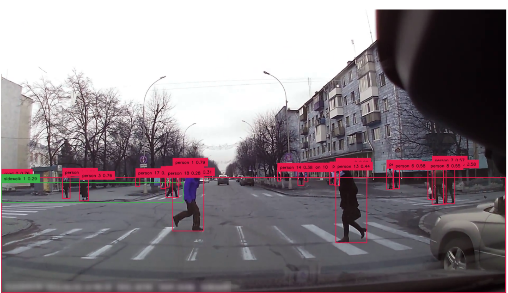
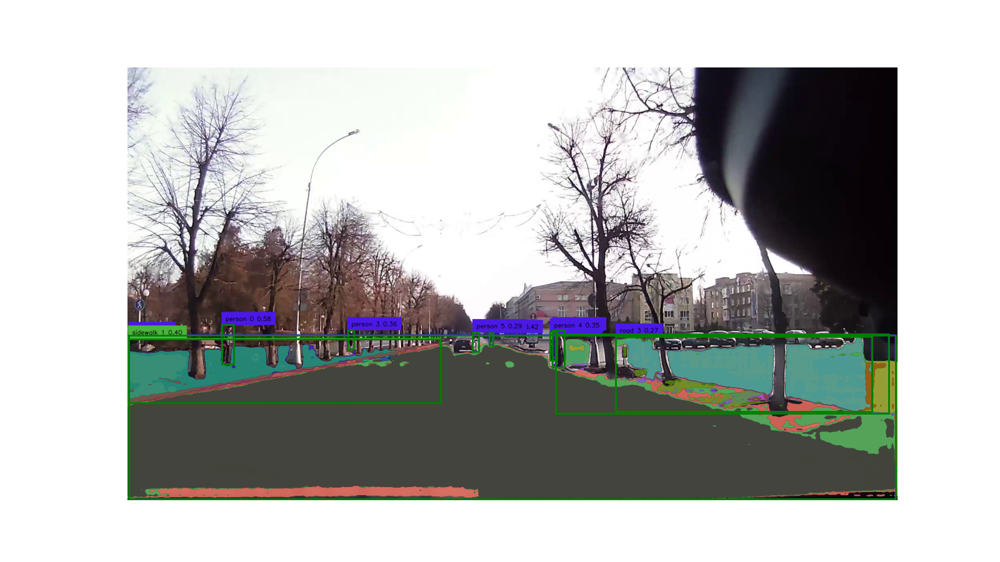
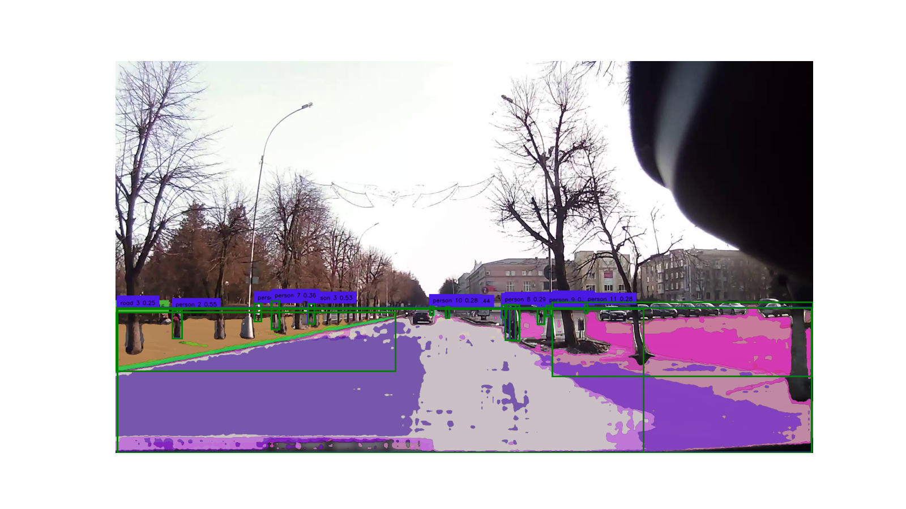
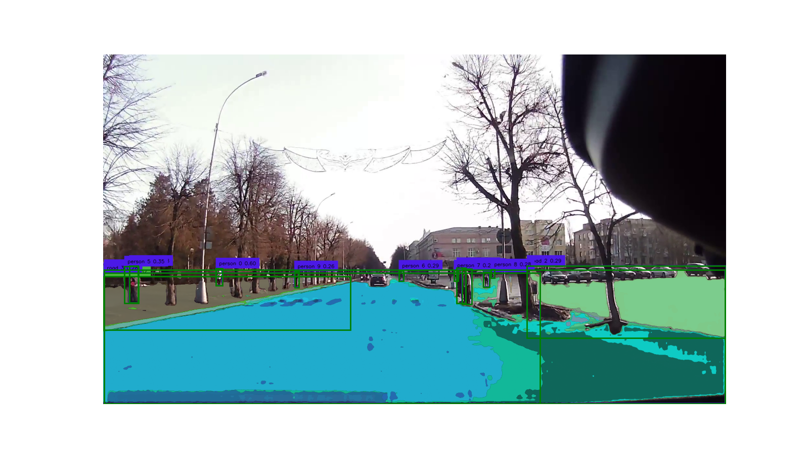

# Blind LLM Guide Project

By Jie Wang & Yingying Huang

07/30/2023

A vision2text cascaded connected model, helping the LLM to detect 


## algorithm

### Object detection: Grounding DINO
- [2022SOTA]
- Transformer based knowledge distillation, SOTA zero-shot detection. 
- can generate bbox of the detected object using monocular image
- Can be prompted based on nature language
- The gDINO can successfully recoginze the road & sidewalk using contrast prompting
- Pedestrian detection is seperate, optimizing the accuracy
- This part can be replaced by yolo7, meeting equivalent performance while much faster

### Segmentation: Segment Anything(SAM)
- [2023SOTA]
- Transformer based unlabeled segmentation, SOTA zero-shot segmentation
- can generate pixel level binary mask of the image
- Can be prompted by both point and box, including positive and negative prompt
- Combining with gDINO, then we realize a SOTA semantic segmentation model 

### Depth estimation: Dense Prediction Transformer(DPT)
- [2021SOTA]
- Transformer based monocular depth estimation
- can generate image-size numpy array indicating the depth value of each pixel
- Based on it, we obtained the distance from dashcam to object

### LLM: gpt3.5_turbo_16k

- long memory, can analyze the road scene with appropriate prompting
- output can be seen here (0728 version):
  - [Summer_Research_2023/Blind_LLM_Guide_Project/Chatbot/chatbot.ipynb - GitHub](https://github.com/Everloom-129/Summer_Research_2023/blob/main/Blind_LLM_Guide_Project/Chatbot/chatbot.ipynb)
  - [Summer_Research_2023/Blind_LLM_Guide_Project/Chatbot/background_info.md - GitHub](https://github.com/Everloom-129/Summer_Research_2023/blob/main/Blind_LLM_Guide_Project/Chatbot/background_info.md)

## Realization procedure

1. **Video Input and Preprocessing:** 

   - Use OpenCV to load video.
   - Extract frames from the video, 3Hz

2. **Frame-level Analysis:** 
   
   - For each frame, detect the regions of interest (pedestrians, road, sidewalk) using gDINO
   - Use bbox to prompt SAM, getting binary mask of detected object
   - Use DPT to obtain the depth information of each frame
   - Rule-based analyze the location and position relationship between pedestrians and surface under them. 
   
     
   
3. **Temporal Analysis:**
   - With the detected entities from each frame in obj_dict, we first align the detected object in each frame using `scipy's distance_matrix & linear_sum_assignment`
     - The closest pedestrian in sequential image is mapped with same id in the dictionary
   - Determine the movement speed of the pedestrians.
     - Achieve this by comparing the pixel location of each pedestrian in the current frame to their location in the previous frame.
   - Depending on the direction and speed of the pedestrian, determine the likely behavior.
     - For example, if the pedestrian is on the sidewalk and moving slowly, they may be walking. If they are on the road and moving quickly, they may be running or crossing the road.

4. **Load into text file**
    Record the behavior of all the pedestrian for each frame.

  ```markdown
  - 6 area of the object
  - location on which surface
  - whether does two surface overlap each other (and percentage)
  - distance and angle between object and dashcam
  - number of detected object
   
  ```

5. **LLM Analysis**

- complexity of the road

- where the potential danger might be on the image

- who is the most dangerous pedestrian

  

## Code 

[04-06-segment-anything/Seg_Road_Sidewalk.ipynb at video · Everloom-129/04-06-segment-anything · GitHub](https://github.com/Everloom-129/04-06-segment-anything/blob/video/Seg_Road_Sidewalk.ipynb)

```python
 
def detect_road(image_path:str, output_path:str):
    image = get_cv2_image(image_path)
    if image is None:
        print("Error when reading ",image_path)
        return None
    ROAD_SIDEWALK = ['road', 'sidewalk'] 
    P_CLASS     = ['person'] #,'bike']
    # Detect objects
    detections = get_detections(image, BOX_TRESHOLD, TEXT_TRESHOLD,ROAD_SIDEWALK)
    p_detections = get_detections(image, BOX_TRESHOLD, PED_TRESHOLD - 0.3, P_CLASS)
    
    labels,DINO_boxes = get_label_and_box(ROAD_SIDEWALK,detections)
    P_labels, P_boxes = get_label_and_box(P_CLASS,p_detections)

    # Segment objects
    SAM_masks = segment_ROI(sam_predictor, image, DINO_boxes)
    P_masks = segment_ROI(sam_predictor, image, P_boxes)
    
    person_annotation = get_annotated_image(image, labels,P_labels,detections,p_detections)

    # Create LocationInfo objects
    obj_dict = get_location_info(DINO_boxes, labels, SAM_masks)
    obj_dict.update(get_location_info(P_boxes, P_labels, P_masks))


    counts = display_mask(SAM_masks,P_masks,P_boxes,DINO_boxes,person_annotation,output_path)

    return obj_dict, counts,labels, P_labels

```

### Todo: Object Tracking
比较困难的实现

```
video_diff：上周的暴力方法，不确定性太高,但思想可以继承
```

#### 和hyy学姐对过之后：

新思路：利用SOTA MOT 模型，做frame-level alignment


obj_dict[person0] = location_info 


SINGLE email

- Object tracking: seq
  - velocity direction
  - Pedestrain
- pytrack 
  - 30 Hz 
    - bbox
  - detect_road 3Hz 
    - bbox 

```
all_person = pytrack(video)
	file(bbox)
	JAAD
10s 
for frame in video[0,frame]:
	p1.bbox = detect_road(frame)
	if p1.bbox ~= file.bbox && frame_time_match(~10ms)
	
	
search algo, 10% pixel ~ then true
二分，改变上下界的不是查而是等于，
存的

	
```

t_bbox[f0] = [(p0, [x1,x2,y1,y2]),(p0, [x1,x2,y1,y2]),[x1,x2,y1,y2],[x1,x2,y1,y2]]

多目标跟踪


- Pose estimation: 

  - 前后左右 

    - classify 

    - DL LSTM single person, easy case 

      - 多目标跟踪，JAAD dataset -> annotated 
      - JAAD

      

  - rule based 

    

#### 获得正确的pedestrian数据后，输出为文本/图像

```python
# Process and write results
def analyze_road(image_path,output_path,counts, labels, P_labels,depth_flag=False):
    image = get_cv2_image(image_path)
    if image is None:
        print("Error when reading ",image_path)
        return None
    
    depth_map = None
    # Predict depth
    if depth_flag:
        depth_map = predict_depth(image_path,output_path)

    # Analyze person location
    p_surface_overlaps = analyze_person_location(obj_dict, depth_flag, image, depth_map)

    if DEBUG:
        # Print out the analysis results
        for person, surfaces in p_surface_overlaps:
            if surfaces:
                surface_str = ', '.join([f"{surface.object_type} {surface.id}" for surface in surfaces])
                print(f"Person {person.id} is on the {surface_str}")
            else:
                print(f"Person {person.id} is not on any detected surface")

    

    write_to_txt(image_path, output_path, p_surface_overlaps, counts, labels, P_labels,obj_dict)

    plt.close()

analyze_road(inputfile,outputfile,obj_dict,counts ,labels, P_labels)
```

#### Note:

1. 视频算法对齐的不能整除的问题：

   

手写30 -> 3 的提取


目标检测

xyxy 

xywh

box 的框对应 

bbox similar 

[x1,x2,y1,y2] ~= [x1+0.01,x2+0.01, y1+0.01, y2+0.01]

变化范围，试着描述然后CP PASTE

10%


model


## Effect

### detection





### masked detection







### text output(without NLP filtering)

> INFO of 0001:
> road 0 is at middle_down
> sidewalk 1 is at left_down
> road 2 is at right_down
> road 3 is at right_down
> person 0 is at left_down
> The [distance,angle] from person 0 to our dashcam is: [close,-89.98588891614122]
> person 1 is at middle_down
> The [distance,angle] from person 1 to our dashcam is: [close,89.9120474339128]
> person 2 is at middle_down
> The [distance,angle] from person 2 to our dashcam is: [close,-89.81182312362785]
> person 3 is at left_down
> The [distance,angle] from person 3 to our dashcam is: [close,-89.97515176581118]
> person 4 is at middle_down
> The [distance,angle] from person 4 to our dashcam is: [close,89.90116549801367]
> person 5 is at middle_down
> The [distance,angle] from person 5 to our dashcam is: [very close,-89.94555249449668]
> Person 0 is on the road 0, sidewalk 1, road 2,his/her bbox is [234.63226 642.2341  264.43335 739.24347]
> Person 1 is on the road 0, sidewalk 1, road 2,his/her bbox is [1059.2721   655.6214  1088.702    747.57806]
> Person 2 is on the road 0, sidewalk 1, road 2,his/her bbox is [901.94855 662.1155  911.4982  692.6168 ]
> Person 3 is on the road 0, sidewalk 1, road 3,his/her bbox is [548.8986  655.32764 564.16583 703.1085 ]
> Person 4 is on the road 0, sidewalk 1, road 3,his/her bbox is [1053.3926   658.24896 1069.481    730.52167]
> Person 5 is on the road 0, sidewalk 1, road 3,his/her bbox is [860.4762  660.27167 875.39307 708.9733 ]
> number of Surface mask, Road&sidewalk, People 's mask, actural people: (12, 4, 12, 6)
> Labels: [road 0 0.59, sidewalk 1 0.40, road 2 0.32, road 3 0.27]
> Person Labels: [person 0 0.58, person 1 0.47, person 2 0.42, person 3 0.36, person 4 0.35, person 5 0.29]
>
> INFO of 0002:
> sidewalk 0 is at left_down
> road 1 is at right_down
> road 2 is at middle_down
> road 3 is at middle_down
> person 0 is at left_down
> The [distance,angle] from person 0 to our dashcam is: [very close,-89.99119131290323]
> person 1 is at middle_down
> The [distance,angle] from person 1 to our dashcam is: [very close,89.97605851501471]
> person 2 is at left_down
> The [distance,angle] from person 2 to our dashcam is: [very close,-89.99366531710781]
> person 3 is at left_down
> The [distance,angle] from person 3 to our dashcam is: [close,-89.9762761823313]
> person 4 is at middle_down
> The [distance,angle] from person 4 to our dashcam is: [close,-89.7891306959436]
> person 5 is at middle_down
> The [distance,angle] from person 5 to our dashcam is: [close,89.92004496344921]
> person 6 is at middle_down
> The [distance,angle] from person 6 to our dashcam is: [close,89.92680217708379]
> person 7 is at left_down
> The [distance,angle] from person 7 to our dashcam is: [close,-89.98075850031837]
> person 8 is at middle_down
> The [distance,angle] from person 8 to our dashcam is: [close,89.90728364752397]
> person 9 is at middle_down
> The [distance,angle] from person 9 to our dashcam is: [close,89.95620542928741]
> person 10 is at middle_down
> The [distance,angle] from person 10 to our dashcam is: [close,-89.88971149464216]
> person 11 is at right_down
> The [distance,angle] from person 11 to our dashcam is: [close,89.9699428160545]
> Person 0 is on the sidewalk 0, road 1, road 2,his/her bbox is [381.57477 666.4457  400.2917  717.0265 ]
> Person 1 is on the sidewalk 0, road 1, road 2,his/her bbox is [1160.2758  680.09   1178.4728  724.6683]
> Person 2 is on the sidewalk 0, road 1, road 2,his/her bbox is [155.84453 685.1025  181.52498 762.48724]
> Person 3 is on the road 3,his/her bbox is [528.6765  667.68396 546.14233 722.3263 ]
> Person 4 is on the road 3,his/her bbox is [907.5679 676.4185 917.3456 706.4229]
> Person 5 is on the road 3,his/her bbox is [1071.0312  668.9684 1099.7461  767.9575]
> Person 6 is not on any detected surface
> Person 7 is not on any detected surface
> Person 8 is not on any detected surface
> Person 9 is not on any detected surface
> Person 10 is not on any detected surface
> Person 11 is not on any detected surface
> number of Surface mask, Road&sidewalk, People 's mask, actural people: (12, 4, 12, 12)
> Labels: [sidewalk 0 0.46, road 1 0.41, road 2 0.40, road 3 0.25]
> Person Labels: [person 0 0.58, person 1 0.57, person 2 0.55, person 3 0.53, person 4 0.44, person 5 0.44, person 6 0.42, person 7 0.36, person 8 0.29, person 9 0.29, person 10 0.28, person 11 0.28]
>
> INFO of 0003:
> sidewalk 0 is at left_down
> road 1 is at middle_down
> road 2 is at right_down
> road 3 is at middle_down
> person 0 is at left_down
> The [distance,angle] from person 0 to our dashcam is: [very close,-89.99168558361397]
> person 1 is at middle_down
> The [distance,angle] from person 1 to our dashcam is: [very close,89.97725341751323]
> person 2 is at middle_down
> The [distance,angle] from person 2 to our dashcam is: [very close,89.96876342422426]
> person 3 is at middle_down
> The [distance,angle] from person 3 to our dashcam is: [close,89.93010104434855]
> person 4 is at left_down
> The [distance,angle] from person 4 to our dashcam is: [close,-89.9884256809594]
> person 5 is at left_down
> The [distance,angle] from person 5 to our dashcam is: [close,-89.98851839861459]
> person 6 is at middle_down
> The [distance,angle] from person 6 to our dashcam is: [very close,-89.87855597563274]
> person 7 is at middle_down
> The [distance,angle] from person 7 to our dashcam is: [very close,89.96059660518104]
> person 8 is at middle_down
> The [distance,angle] from person 8 to our dashcam is: [very close,89.97917614300947]
> person 9 is at left_down
> The [distance,angle] from person 9 to our dashcam is: [close,-89.97243413472336]
> Person 0 is on the sidewalk 0, road 1, road 2, road 3,his/her bbox is [347.2728  660.62646 366.93454 712.9728 ]
> Person 1 is on the sidewalk 0, road 1, road 2, road 3,his/her bbox is [1171.1841   671.6401  1189.5618   717.58417]
> Person 2 is on the sidewalk 0, road 1, road 2, road 3,his/her bbox is [1105.8005   661.0793  1135.1521   771.68475]
> Person 3 is on the road 3,his/her bbox is [1089.5068   659.13763 1117.3489   768.5402 ]
> Person 4 is on the road 3,his/her bbox is [ 80.04819 652.7423  107.58861 766.66174]
> Person 5 is on the road 3,his/her bbox is [ 65.21777 654.53046 108.42963 767.0861 ]
> Person 6 is on the road 3,his/her bbox is [911.7038 667.633  925.7442 698.6021]
> Person 7 is on the road 3,his/her bbox is [1081.3564   666.5441  1093.075    699.60077]
> Person 8 is on the road 3,his/her bbox is [1195.4225   663.72876 1206.0187   689.9066 ]
> Person 9 is on the road 3,his/her bbox is [589.43494 669.15015 603.18274 718.93164]
> number of Surface mask, Road&sidewalk, People 's mask, actural people: (12, 4, 12, 10)
> Labels: [sidewalk 0 0.52, road 1 0.44, road 2 0.29, road 3 0.28]
> Person Labels: [person 0 0.60, person 1 0.55, person 2 0.45, person 3 0.44, person 4 0.38, person 5 0.35, person 6 0.29, person 7 0.29, person 8 0.28, person 9 0.26]