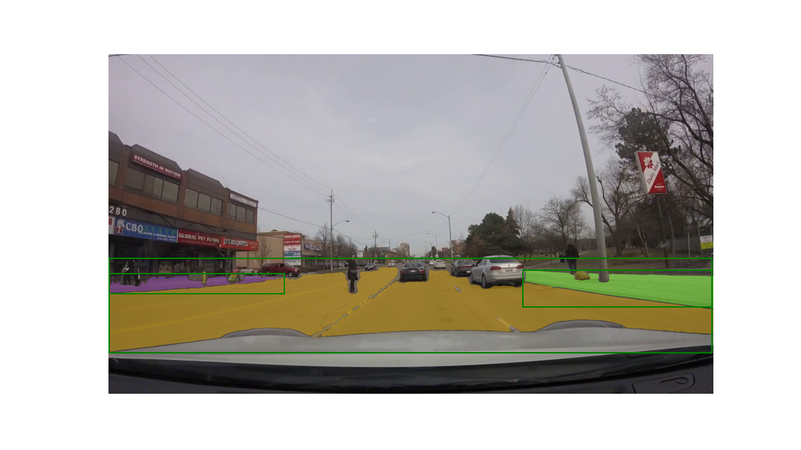
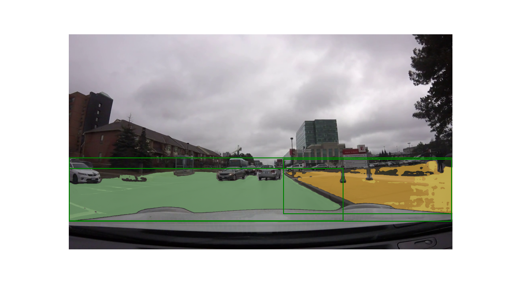
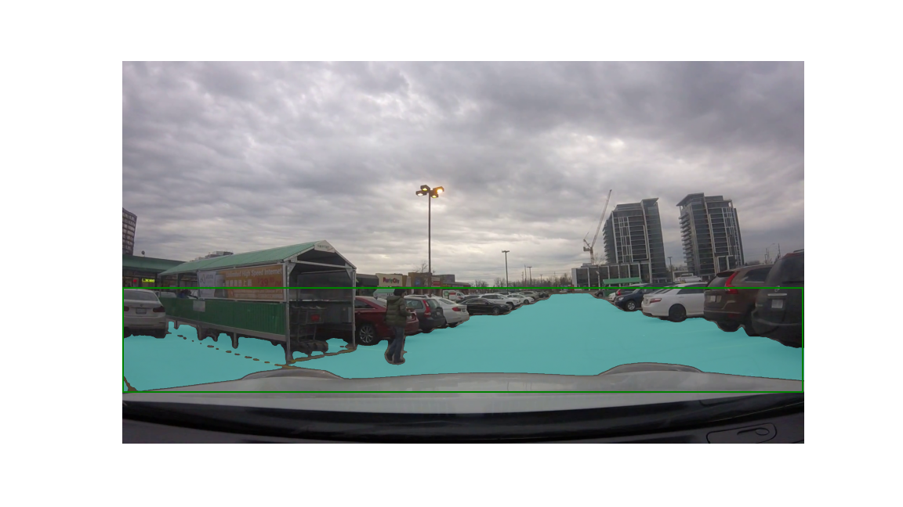
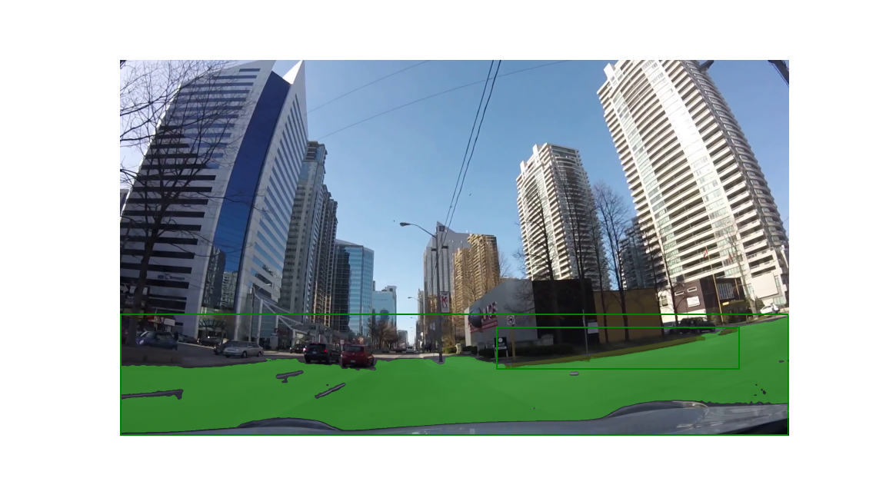
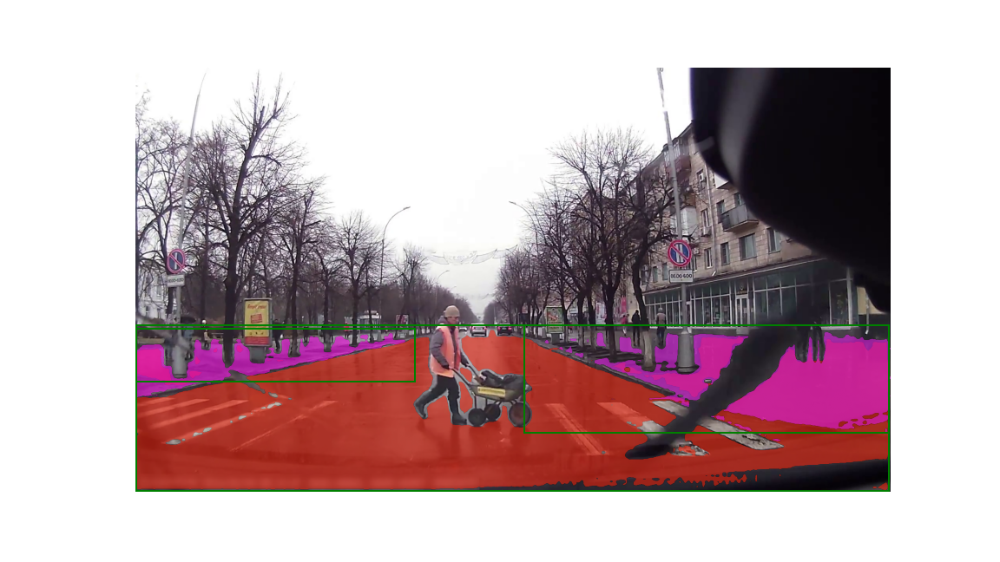
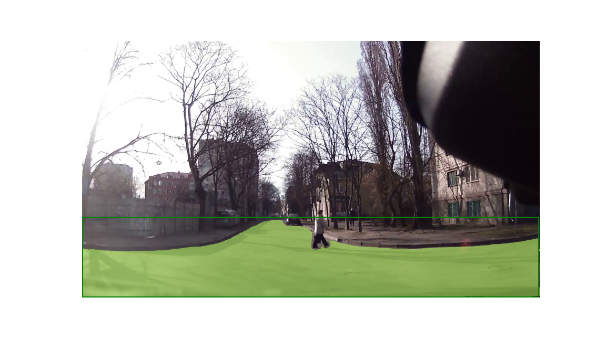
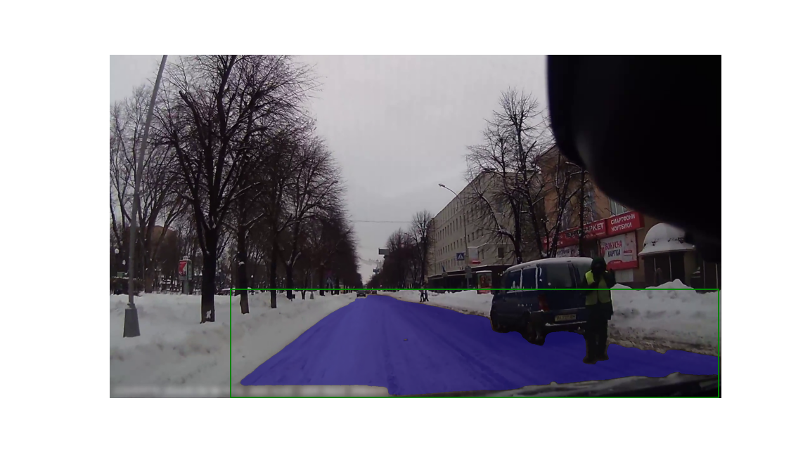
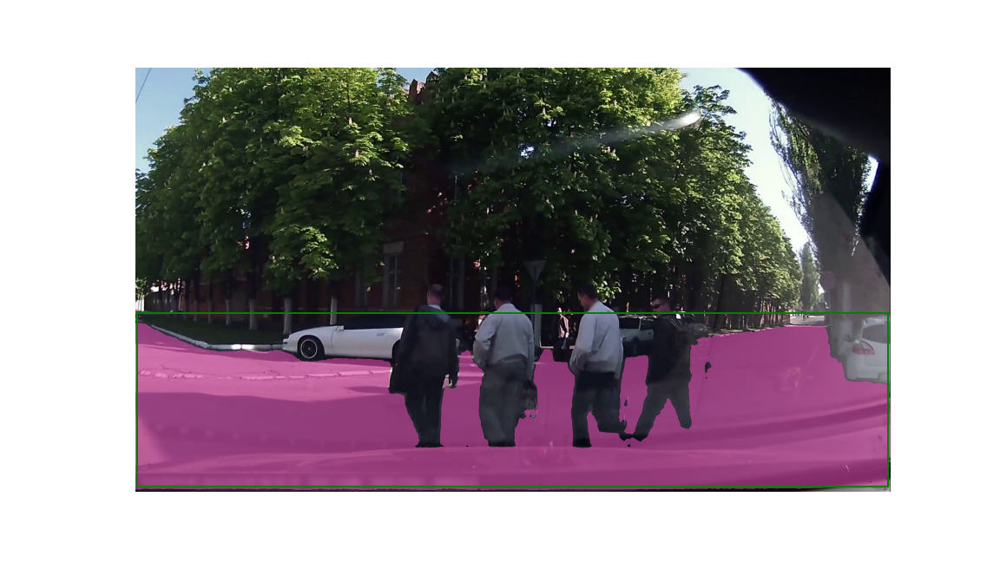
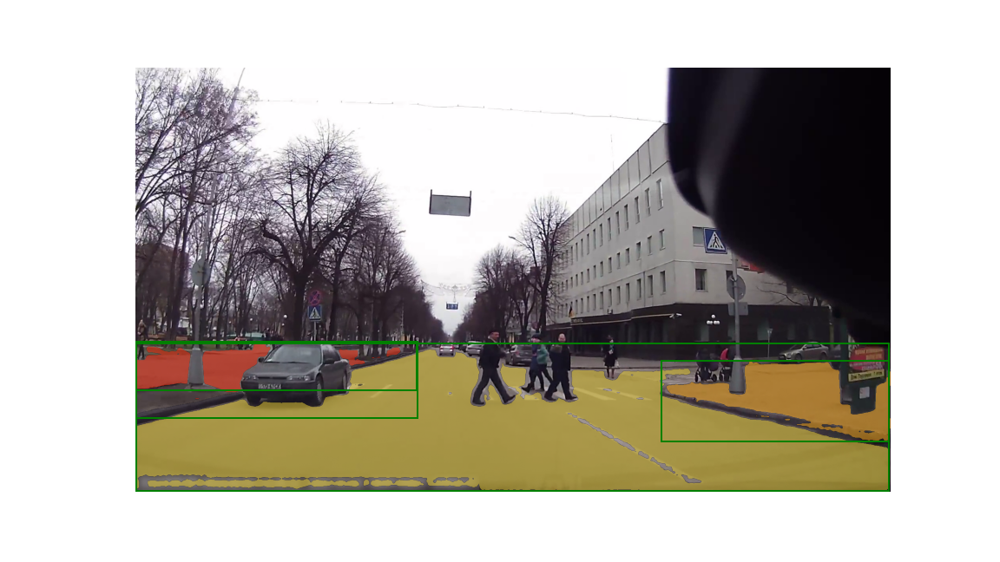

# Segmented Road

based on gDINO + SAM, I realize basic semantic segmentation on road and sidewalk.

Here I didn't take person into account, but it won't be hard if necessary.

## Architecture

1. - [x]  gDINO : grounding_dino_model.predict_with_classes

   CLASSES_prompt= ['road', 'sidewalk']

   Based on testing, this pair is most reliable (otherwise the sidewalk may messed up with road) 

   In this part, I use the box as Region of Interest(ROI) to further prompt SAM

2. - [x]  Non-maximum suppression (NMS) :

   get rid of redundant and overlapping bounding boxes.

   the metric is Intersection over Union(IoU)

3. - [x] Prompting SAM with ROI, select mask with largest area, in this step, the road and sidewalk can be segmented with naming in pixel level accuracy.

4. - [x] save the result 

5. - [x]  label the result with label and confidence

6. - [x] do image sequence experiment, analyze the behavior of person

7. - [ ]  split cases based on JAAD info

   - car is moving 
   - car is stopping
   - time
   - weather
   - more...

In GTX3090 environment, the algorithm runs relatively fast with GPU boosting.

(Not as bad as I guessed before, much faster than all of the online demo)

## Plan

continue working on the code, I think it is solid and interesting than other task. 

Meanwhile, we seems to be the first team trying to segment road using SAM. 

#### GPT-enhanced working

Now I have one-image working code, how do I analyze the pedestrian's behavior after I get  

- the pixel location of person
- the pixel location of road - 
- the pixel location of sidewalk
- the moving status of car (it is moving or not) 
- a sequence of image in 5~15s, image sequence is loaded from video clips, which can display in frame level 
Think step by step, the key problem is how to do sequence analysis, provide me with a code architecture

> It seems like you're trying to analyze pedestrian behavior in video sequences. Here's a high-level overview of how you might set up your code to achieve this.
>
> 1. **Video Input and Preprocessing:** *Done*
>    - Use OpenCV or similar library to load video.
>    - Extract frames from the video.
>    - Optionally resize frames or convert to grayscale for faster processing.
>
> 2. **Frame-level Analysis:**
>    - For each frame, detect the regions of interest (pedestrians, road, sidewalk) using your detection methods.
>    - Record the pixel location of each detected entity for each frame.
>
> 3. **Temporal Analysis:**
>    - With the detected entities from each frame, we now perform analysis across the temporal axis.
>    - Determine the movement direction and speed of the pedestrians.
>      - You can achieve this by comparing the pixel location of each pedestrian in the current frame to their location in the previous frame.
>    - Depending on the direction and speed of the pedestrian, determine the likely behavior.
>      - For example, if the pedestrian is on the sidewalk and moving slowly, they may be walking. If they are on the road and moving quickly, they may be running or crossing the road.
>    - Record the behavior for each frame.
>
> 4. **Behavior Analysis:**
>    - Now that we have the behavior for each frame, we can start to look for patterns or notable events.
>    - For example, if we see a pedestrian suddenly start running from the sidewalk to the road, that might be a noteworthy event.
>    - Summarize or visualize the behaviors detected in the video.
>
> 5. **Car Movement Analysis:**
>    - Analyze the car's moving status.
>    - If the car is not moving and pedestrians are moving around the car or crossing the road, it could indicate the car has stopped to allow pedestrians to cross.
>    - If the car is moving, track the car's movement and relate it to the pedestrian's behavior. If a pedestrian starts to run as soon as the car starts to move, it might be a situation of jaywalking or the pedestrian trying to avoid the car.
>
> Here is a simple skeleton of the code:
>
> ```python
> class VideoAnalyzer:
>     def __init__(self, video_path):
>         self.video_path = video_path
>         self.frames = self.load_video()
>         self.frame_results = []
> 
>     def load_video(self):
>         # Use OpenCV or similar to load video and extract frames
>         pass
> 
>     def analyze_frame(self, frame):
>         # Analyze individual frame and return result
>         pass
> 
>     def analyze_temporal(self):
>         # Analyze temporal trends
>         pass
> 
>     def summarize_behavior(self):
>         # Summarize or visualize the behaviors detected in the video
>         pass
> 
>     def analyze(self):
>         for frame in self.frames:
>             result = self.analyze_frame(frame)
>             self.frame_results.append(result)
> 
>         self.analyze_temporal()
>         self.summarize_behavior()
> 
> analyzer = VideoAnalyzer("path/to/video.mp4")
> analyzer.analyze()
> ```
>
> This is just a rough skeleton and the real implementation might be a lot more complex, especially for the `analyze_frame` and `analyze_temporal` methods. For the actual implementation of those methods, you would likely need a deep learning model, possibly trained on a dataset of pedestrian behaviors or unsupervised learning techniques.


### TEST ON GPT
### role: You are a 
As an AI Driver Assistant, you are observing the current road situation from the front-facing camera feed. Your task is to analyze the complexity of the current road conditions based on the information provided and give a professional driving suggestion. Here's the observed data:

- There are a total of 6 surface masks detected in the scene.
- There are 2 Road and Sidewalk objects detected.
- There are 6 detected masks representing people, with 15 actual people detected.
- Person 0, 2, and 5 are detected on the right_down of the image, on road 0.
- Person 1 is detected on the left_down of the image, on both road 0 and sidewalk 1.
- Person 3 and 4 are detected on the middle_down of the image, on road 0.
- Road 0 is located at the middle_down part of the image.
- Sidewalk 1 is located at the left_down part of the image.

Considering this information, what would be your advice for safe and efficient driving?",
    "max_tokens": 200
New crossroad environment:
Person 0 is on the road 0, sidewalk 1
Person 1 is on the road 0, sidewalk 1
Person 2 is on the road 0, sidewalk 1
Person 3 is on the road 0, sidewalk 1
Person 4 is on the road 0, sidewalk 1
Person 5 is on the road 0, sidewalk 1
number of Surface mask, Road&sidewalk, People 's mask, actural people:  6 2 6 15
output_dir:  DINOmasked/video_0268
image_name:  0003
txt_path:  DINOmasked/video_0268/Info_Video_0268.txt
road 0 is at middle_down
sidewalk 1 is at left_down
person 0 is at right_down
person 1 is at left_down
person 2 is at right_down
person 3 is at middle_down
person 4 is at middle_down
person 5 is at right_down


## Instance

The boxed area is the segmented part

each is unlabeled under sam output, but they can be labeled by gDINO

Usually, big box indicates "road"

small box indicates "sidewalk"

In some cases, sidewalk can't be demonstrated clearly, but road always have a good representation. 



video_0010_0002: At both side of the road, the sidewalk is segmented correctly

video_0015_0011:  parking lot case, good



video_0017_0008: parking lot case, only the road is detected, which is correct



video_0037_0005: only right part of the sidewalk is segmented, the left one wasn't 




video_0087_0008: good job



video_0104_0003: fail to recognize sidewalk in backlighting scenario



video_0128_0005: fail (or there is no ?) to find sidewalk in snow weather



video_0139_0004: sometimes it will treat the vehicle hood as road.. very werid



video_0139_0004: it seems the further sidewalk is harder to recognize


