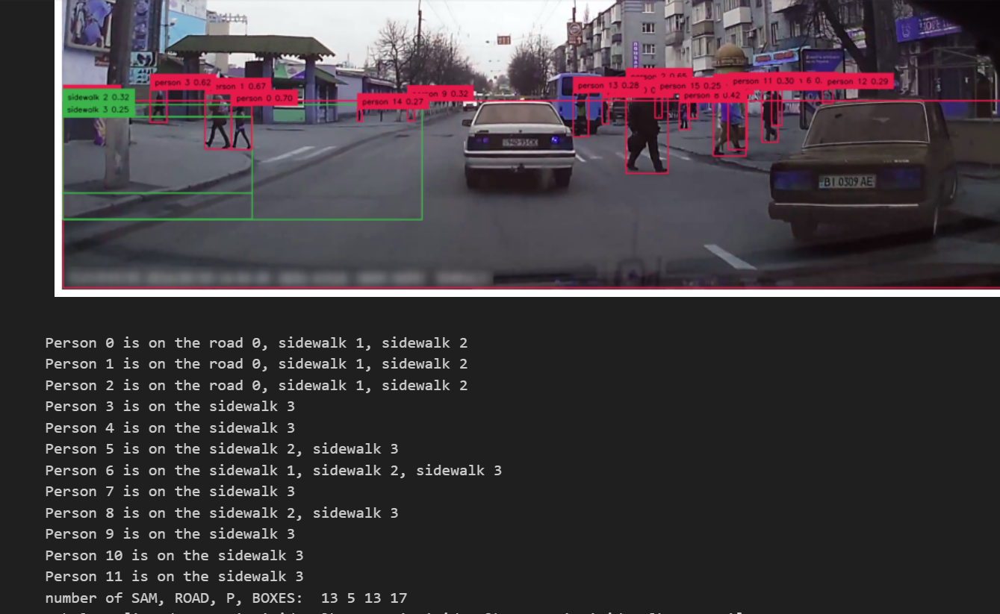
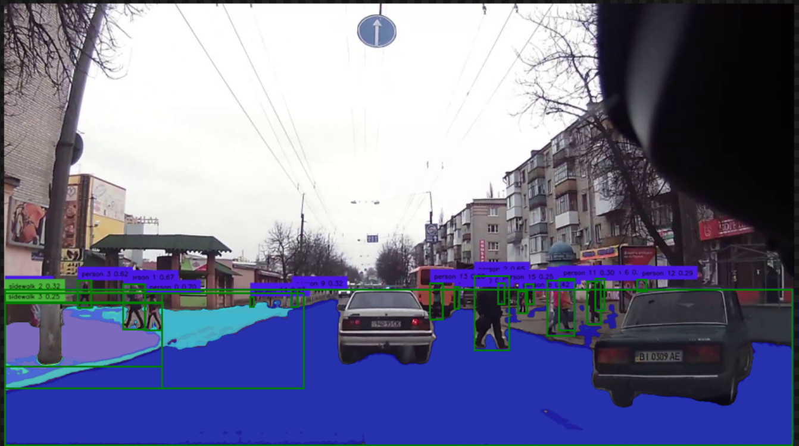

# Literature Review Prompt Point

> *Focus on what should we do, cite other's work*

王杰，2023年7月10日

### Background:

The HCI side work:

## Possible Tech Outcome

### 7.9 Small Demo

masked form

The important data : box location, pixel level info(given by mask)

> 我试了一下能不能在图片上直接label, 发现比较困难，supervision的annoater 自定义程度比较低，不能切换 label,而且场景里的人和车太多了，不能达到一个比较好的效果

### Idea

#### Baseline: Img2Txt

因为最后其实不需要图片输出，只需要文本给gpt. 我现在可以很方便的判断：哪个行人在哪个road/sidewalk上，这个road 在车左边还是右边，规则很好写. 

有一个问题就是精度，我之前在调试的一个是各种SAM 的影响，另外一个就是seg出来的东西能不能取optimal 

我觉得 if 眼动 可分析车窗的三个区域（左中右），我这里的模态输入就可以在text level merge 进gpt 

分析三个区域是有啥依据, 有些论文有类似的分区方法? 我开车时的感觉吧，以及我这里道路分割的依据：左侧，前路，右侧，具体风险等级不一样 如果人都跑到路中间了自然危险一点，也没做太多的分析

#### Insight

灵感，LLM不应该只是被动的收集信息，他应该主动调用API， 去探测前面的路口状况，让他作为一个Agent去执行分析任务。 这样就可以自动化的收集信息，分析数据了

比方说我可以写点segment 的API， 让他可以把一个image的interesting area/ box 切割出来，再图生文，用VQA 或者再调用现有api，输出更多的text info

今天我看了那个code interpreter, 我觉得是有这个能力，不花特别大代价（不自己搭环境）做到类似效果的

总之目前进一步目标是部署骨骼，提供更多姿态信息

要是能分类出行人是”老人，小孩，女人，男人“就好了

角度和测距做了吗没做就先做这俩。做了就先做朝向，朝向用video或者骨骼点都可以能做出来就行

# Multimodal Approach: Integrating Visual Data into Language Models

> I asked GPT-4 to summarize and formalize our meeting into academic English

The incorporation of multimodal data, such as spatial coordinates and pixel-level information into language learning models (LLMs), has emerged as an effective strategy for enhancing the interpretability of complex data sets. The spatial information can be represented as 'box' coordinates, while the pixel-level details can be rendered through masks.

## Challenge with Direct Image Labeling

During an initial phase, we experimented with direct image labeling. However, this method presented significant challenges. The flexibility of the supervision annotator was found to be quite low, and the feature did not support the switch between labels. In addition, due to the large number of people and cars in the scene, it was difficult to achieve a satisfactory effect with this method.

## Baseline Approach: Image to Text

The final objective of our project does not necessitate the output of images, as the primary requirement is to feed text into the Generative Pretrained Transformer (GPT). Currently, we can accurately determine which pedestrian is on which road or sidewalk, and whether the road is located to the left or right of the car. This information is easy to encode into rules.

However, two main challenges emerged in our approach. The first pertained to the accuracy of our method, and the second was whether the segmented data could be optimised. We reasoned that if we could analyse the three areas of a car window (left, center, and right), we could merge modal input into the GPT at the text level. Our decision to analyse these three regions was not solely based on literature but also on our experience as drivers and our ability to segment roads into the left, straight ahead, and right segments, each of which carries a different risk level. For instance, pedestrians who are in the middle of the road pose a higher risk.

## Insight and Future Directions

Our initial explorations inspired a fundamental insight: an LLM should not be a passive collector of information but should actively call an API to assess the road conditions ahead. By behaving as an agent to execute analytical tasks, the LLM could automate the information collection and data analysis process. For instance, we could write segmentation APIs that allow the LLM to segment interesting areas or boxes from an image. The image can then be converted into text using Visual Question Answering (VQA) or existing APIs to generate more text information.

In addition, the code interpreter that we reviewed today appears to have the capacity to produce similar results without a significant cost (i.e., without setting up an environment).

As we progress, our immediate goal is to deploy a skeletal model to provide more posture information. It would be beneficial if the model could categorize pedestrians into groups such as "elderly, children, women, men." 

If the angle and range measurement tasks have not been done yet, those should be our priority. If they have been done, we should first work on orientation, which can be done with video or skeletal points. Achieving this would mark a significant milestone in our project.
