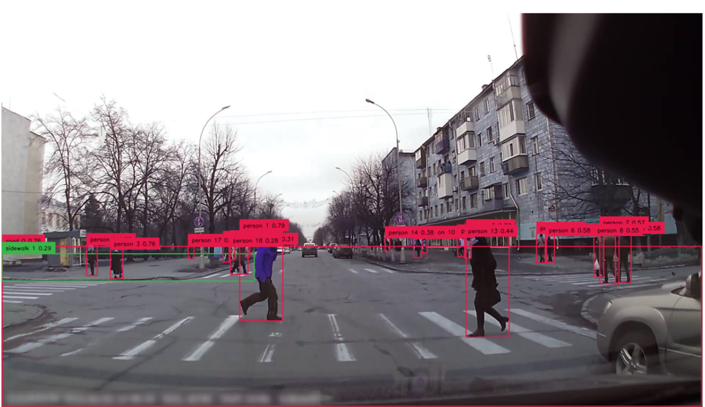
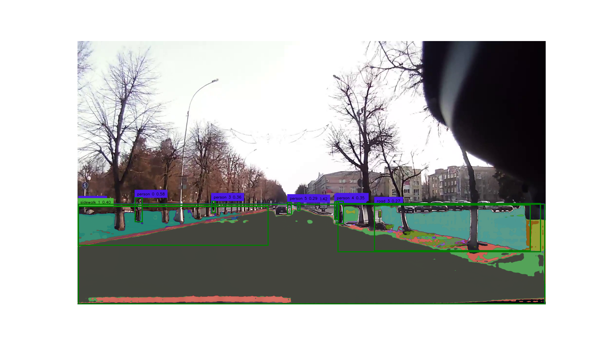
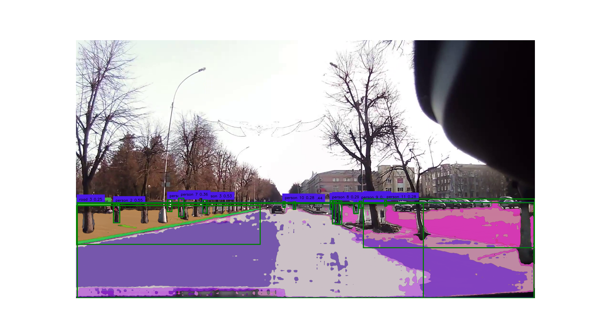
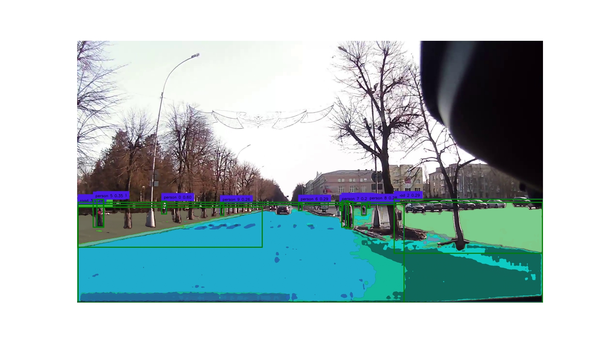

# 盲导：给予大语言模型以视力

作者：王杰，黄莹莹

07/30/2023

这里是一个视觉转文本级联模型的技术demo，旨在帮助语言模型角色扮演为副驾驶，检测路况并分析潜在的驾驶风险

## 算法

### 对象检测：Grounding DINO

- [2022年SOTA]
- 基于transformer的知识蒸馏，SOTA的Zero-shot检测技术。
- 可以使用单目图像生成检测到的对象的边界框
- 可以根据自然语言进行prompt
- gDINO可以成功地通过对比prompt识别道路和人行道
- 单独进行行人检测，以优化精度
  - 这可以被yolo7替换，性能相当但速度更快

### 分割：Segment Anything(SAM)

- [2023年SOTA]
- 基于transformer的无标签分割，SOTA的Zero-shot分割
- 可以生成图像级别的二值遮罩
- 可以通过点和框进行prompt，包括正prompt和负prompt
- 结合gDINO，我们实现了一个SOTA的语义分割模型

### 深度估计：Dense Prediction Transformer(DPT)

- [2021年SOTA]
- 基于transformer的单眼深度估计
- 可以生成表示每个像素深度值的图像大小的NumPy数组
- 基于它，我们得到了摄像头到物体的距离和相对摄像头角度

### LLM：gpt3.5_turbo_16k

- 长记忆，可以通过适当的prompt分析路面场景

  - system message:
    ```markdown
    ChatGPT, based on the incoming road scenario data, I need you to assess the situation and provide us with critical information. 
    ## input
    The road scenario data will be provided in {'context'}, it contains the continuous frame information of video from dashcam in the vehicle. The autonomous system provides you with information on road layout, people's locations, their distances and angles from the dashcam, the surfaces they are on, and the confidence level of each detection.
    ## output 
    Your analysis should provide:
    - an understanding of the context complexity (low, medium, or high), 
    - the number of persons, cars, and bikes present in the scene, 
    - an array detailing the danger level for each person, if applicable.
    The output should be markdown format
    
    This analysis should be grounded in the current context and make predictions for the short term future to assist in autonomous driving. The key goal here is to identify potential risks to enhance the safety and efficiency of our journey.
    ```

    

- 输出结果参考(0728版本)：
  - [Summer_Research_2023/Blind_LLM_Guide_Project/Chatbot/chatbot.ipynb - GitHub](https://github.com/Everloom-129/Summer_Research_2023/blob/main/Blind_LLM_Guide_Project/Chatbot/chatbot.ipynb)
  - [Summer_Research_2023/Blind_LLM_Guide_Project/Chatbot/background_info.md - GitHub](https://github.com/Everloom-129/Summer_Research_2023/blob/main/Blind_LLM_Guide_Project/Chatbot/background_info.md)

## 实现过程

1. **视频输入和预处理：** 

   - 使用OpenCV导入视频。
   - 从视频中提取帧，降采样频率为3Hz

2. **帧级分析：** 

   - 对于每一帧，使用gDINO检测感兴趣的区域（行人，道路，人行道）

   - 使用边界框promptSAM，获取检测到的物体的二值遮罩

   - 使用DPT获取每一帧的深度信息

   - 基于规则分析行人和他们下方表面的位置和位置关系。

3. **时间序列分析：**
   - 对于obj_dict中每一帧检测到的实体，我们首先使用`scipy的distance_matrix & linear_sum_assignment`在每一帧中对检测到的对象进行对齐
     - 在连续图像中最近的行人在字典中映射到相同的id
   - 确定行人的移动速度。
     - 通过比较当前帧中每个行人的像素位置和他们在前一帧中的位置来实现这一点。
   - 根据行人的方向和速度，确定可能的行为。
     - 例如，如果行人在人行道上并且移动缓慢，他们可能在行走。如果他们在道路上并且移动快，他们可能在奔跑或穿越道路。
   
4. **导出到文本文件**
   记录每一帧所有行人的行为。

  ```markdown
- 物体的6个区域
- 物体在哪个表面上
- 两个表面是否重叠（以及百分比）
- 物体和摄像头之间的距离和角度
- 检测到的物体的数量
 
  ```

5. **读取文本，调用LLM分析**

- 路面的复杂性

- 图像上可能存在的潜在危险

- 最危险的行人是谁（一个危险度的maxheap)

## Code 

[04-06-segment-anything/Seg_Road_Sidewalk.ipynb at video · Everloom-129/04-06-segment-anything · GitHub](https://github.com/Everloom-129/04-06-segment-anything/blob/video/Seg_Road_Sidewalk.ipynb)

```python
 
def detect_road(image_path:str, output_path:str):
    image = get_cv2_image(image_path)
    if image is None:
        print("Error when reading ",image_path)
        return None
    ROAD_SIDEWALK = ['road', 'sidewalk'] 
    P_CLASS     = ['person'] #,'bike']
    # Detect objects
    detections = get_detections(image, BOX_TRESHOLD, TEXT_TRESHOLD,ROAD_SIDEWALK)
    p_detections = get_detections(image, BOX_TRESHOLD, PED_TRESHOLD - 0.3, P_CLASS)
    
    labels,DINO_boxes = get_label_and_box(ROAD_SIDEWALK,detections)
    P_labels, P_boxes = get_label_and_box(P_CLASS,p_detections)

    # Segment objects
    SAM_masks = segment_ROI(sam_predictor, image, DINO_boxes)
    P_masks = segment_ROI(sam_predictor, image, P_boxes)
    
    person_annotation = get_annotated_image(image, labels,P_labels,detections,p_detections)

    # Create LocationInfo objects
    obj_dict = get_location_info(DINO_boxes, labels, SAM_masks)
    obj_dict.update(get_location_info(P_boxes, P_labels, P_masks))


    counts = display_mask(SAM_masks,P_masks,P_boxes,DINO_boxes,person_annotation,output_path)

    return obj_dict, counts,labels, P_labels
```


```python
# Process and write results
def analyze_road(image_path,output_path,counts, labels, P_labels,depth_flag=False):
    image = get_cv2_image(image_path)
    if image is None:
        print("Error when reading ",image_path)
        return None
    
    depth_map = None
    # Predict depth
    if depth_flag:
        depth_map = predict_depth(image_path,output_path)

    # Analyze person location
    p_surface_overlaps = analyze_person_location(obj_dict, depth_flag, image, depth_map)

    if DEBUG:
        # Print out the analysis results
        for person, surfaces in p_surface_overlaps:
            if surfaces:
                surface_str = ', '.join([f"{surface.object_type} {surface.id}" for surface in surfaces])
                print(f"Person {person.id} is on the {surface_str}")
            else:
                print(f"Person {person.id} is not on any detected surface")

    

    write_to_txt(image_path, output_path, p_surface_overlaps, counts, labels, P_labels,obj_dict)

    plt.close()

analyze_road(inputfile,outputfile,obj_dict,counts ,labels, P_labels)
```

## 演示效果

### 道路检测及分割




### 遮罩：道路分割







### text output(without NLP filtering)

> INFO of 0001:
> road 0 is at middle_down
> sidewalk 1 is at left_down
> road 2 is at right_down
> road 3 is at right_down
> person 0 is at left_down
> The [distance,angle] from person 0 to our dashcam is: [close,-89.98588891614122]
> person 1 is at middle_down
> The [distance,angle] from person 1 to our dashcam is: [close,89.9120474339128]
> person 2 is at middle_down
> The [distance,angle] from person 2 to our dashcam is: [close,-89.81182312362785]
> person 3 is at left_down
> The [distance,angle] from person 3 to our dashcam is: [close,-89.97515176581118]
> person 4 is at middle_down
> The [distance,angle] from person 4 to our dashcam is: [close,89.90116549801367]
> person 5 is at middle_down
> The [distance,angle] from person 5 to our dashcam is: [very close,-89.94555249449668]
> Person 0 is on the road 0, sidewalk 1, road 2,his/her bbox is [234.63226 642.2341  264.43335 739.24347]
> Person 1 is on the road 0, sidewalk 1, road 2,his/her bbox is [1059.2721   655.6214  1088.702    747.57806]
> Person 2 is on the road 0, sidewalk 1, road 2,his/her bbox is [901.94855 662.1155  911.4982  692.6168 ]
> Person 3 is on the road 0, sidewalk 1, road 3,his/her bbox is [548.8986  655.32764 564.16583 703.1085 ]
> Person 4 is on the road 0, sidewalk 1, road 3,his/her bbox is [1053.3926   658.24896 1069.481    730.52167]
> Person 5 is on the road 0, sidewalk 1, road 3,his/her bbox is [860.4762  660.27167 875.39307 708.9733 ]
> number of Surface mask, Road&sidewalk, People 's mask, actural people: (12, 4, 12, 6)
> Labels: [road 0 0.59, sidewalk 1 0.40, road 2 0.32, road 3 0.27]
> Person Labels: [person 0 0.58, person 1 0.47, person 2 0.42, person 3 0.36, person 4 0.35, person 5 0.29]
>
> INFO of 0002:
> sidewalk 0 is at left_down
> road 1 is at right_down
> road 2 is at middle_down
> road 3 is at middle_down
> person 0 is at left_down
> The [distance,angle] from person 0 to our dashcam is: [very close,-89.99119131290323]
> person 1 is at middle_down
> The [distance,angle] from person 1 to our dashcam is: [very close,89.97605851501471]
> person 2 is at left_down
> The [distance,angle] from person 2 to our dashcam is: [very close,-89.99366531710781]
> person 3 is at left_down
> The [distance,angle] from person 3 to our dashcam is: [close,-89.9762761823313]
> person 4 is at middle_down
> The [distance,angle] from person 4 to our dashcam is: [close,-89.7891306959436]
> person 5 is at middle_down
> The [distance,angle] from person 5 to our dashcam is: [close,89.92004496344921]
> person 6 is at middle_down
> The [distance,angle] from person 6 to our dashcam is: [close,89.92680217708379]
> person 7 is at left_down
> The [distance,angle] from person 7 to our dashcam is: [close,-89.98075850031837]
> person 8 is at middle_down
> The [distance,angle] from person 8 to our dashcam is: [close,89.90728364752397]
> person 9 is at middle_down
> The [distance,angle] from person 9 to our dashcam is: [close,89.95620542928741]
> person 10 is at middle_down
> The [distance,angle] from person 10 to our dashcam is: [close,-89.88971149464216]
> person 11 is at right_down
> The [distance,angle] from person 11 to our dashcam is: [close,89.9699428160545]
> Person 0 is on the sidewalk 0, road 1, road 2,his/her bbox is [381.57477 666.4457  400.2917  717.0265 ]
> Person 1 is on the sidewalk 0, road 1, road 2,his/her bbox is [1160.2758  680.09   1178.4728  724.6683]
> Person 2 is on the sidewalk 0, road 1, road 2,his/her bbox is [155.84453 685.1025  181.52498 762.48724]
> Person 3 is on the road 3,his/her bbox is [528.6765  667.68396 546.14233 722.3263 ]
> Person 4 is on the road 3,his/her bbox is [907.5679 676.4185 917.3456 706.4229]
> Person 5 is on the road 3,his/her bbox is [1071.0312  668.9684 1099.7461  767.9575]
> Person 6 is not on any detected surface
> Person 7 is not on any detected surface
> Person 8 is not on any detected surface
> Person 9 is not on any detected surface
> Person 10 is not on any detected surface
> Person 11 is not on any detected surface
> number of Surface mask, Road&sidewalk, People 's mask, actural people: (12, 4, 12, 12)
> Labels: [sidewalk 0 0.46, road 1 0.41, road 2 0.40, road 3 0.25]
> Person Labels: [person 0 0.58, person 1 0.57, person 2 0.55, person 3 0.53, person 4 0.44, person 5 0.44, person 6 0.42, person 7 0.36, person 8 0.29, person 9 0.29, person 10 0.28, person 11 0.28]
>
> INFO of 0003:
> sidewalk 0 is at left_down
> road 1 is at middle_down
> road 2 is at right_down
> road 3 is at middle_down
> person 0 is at left_down
> The [distance,angle] from person 0 to our dashcam is: [very close,-89.99168558361397]
> person 1 is at middle_down
> The [distance,angle] from person 1 to our dashcam is: [very close,89.97725341751323]
> person 2 is at middle_down
> The [distance,angle] from person 2 to our dashcam is: [very close,89.96876342422426]
> person 3 is at middle_down
> The [distance,angle] from person 3 to our dashcam is: [close,89.93010104434855]
> person 4 is at left_down
> The [distance,angle] from person 4 to our dashcam is: [close,-89.9884256809594]
> person 5 is at left_down
> The [distance,angle] from person 5 to our dashcam is: [close,-89.98851839861459]
> person 6 is at middle_down
> The [distance,angle] from person 6 to our dashcam is: [very close,-89.87855597563274]
> person 7 is at middle_down
> The [distance,angle] from person 7 to our dashcam is: [very close,89.96059660518104]
> person 8 is at middle_down
> The [distance,angle] from person 8 to our dashcam is: [very close,89.97917614300947]
> person 9 is at left_down
> The [distance,angle] from person 9 to our dashcam is: [close,-89.97243413472336]
> Person 0 is on the sidewalk 0, road 1, road 2, road 3,his/her bbox is [347.2728  660.62646 366.93454 712.9728 ]
> Person 1 is on the sidewalk 0, road 1, road 2, road 3,his/her bbox is [1171.1841   671.6401  1189.5618   717.58417]
> Person 2 is on the sidewalk 0, road 1, road 2, road 3,his/her bbox is [1105.8005   661.0793  1135.1521   771.68475]
> Person 3 is on the road 3,his/her bbox is [1089.5068   659.13763 1117.3489   768.5402 ]
> Person 4 is on the road 3,his/her bbox is [ 80.04819 652.7423  107.58861 766.66174]
> Person 5 is on the road 3,his/her bbox is [ 65.21777 654.53046 108.42963 767.0861 ]
> Person 6 is on the road 3,his/her bbox is [911.7038 667.633  925.7442 698.6021]
> Person 7 is on the road 3,his/her bbox is [1081.3564   666.5441  1093.075    699.60077]
> Person 8 is on the road 3,his/her bbox is [1195.4225   663.72876 1206.0187   689.9066 ]
> Person 9 is on the road 3,his/her bbox is [589.43494 669.15015 603.18274 718.93164]
> number of Surface mask, Road&sidewalk, People 's mask, actural people: (12, 4, 12, 10)
> Labels: [sidewalk 0 0.52, road 1 0.44, road 2 0.29, road 3 0.28]
> Person Labels: [person 0 0.60, person 1 0.55, person 2 0.45, person 3 0.44, person 4 0.38, person 5 0.35, person 6 0.29, person 7 0.29, person 8 0.28, person 9 0.26]