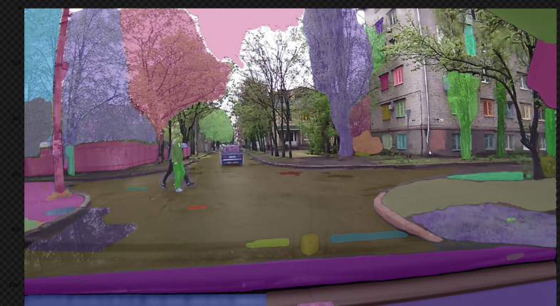
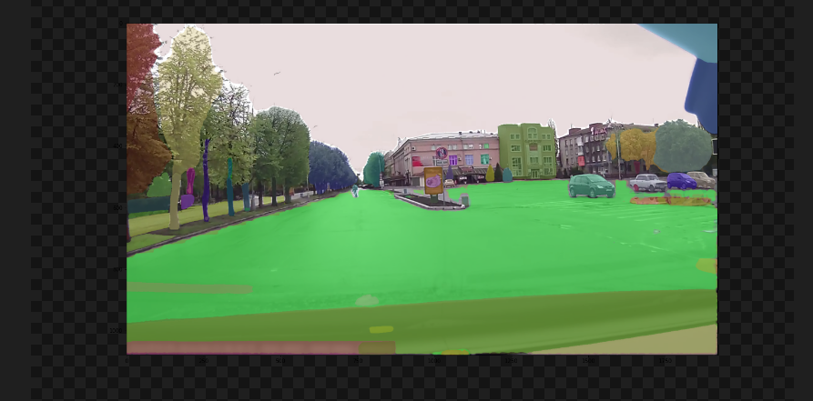

## 0630 对SAM+JAAD的反馈

### 1. JAAD里无车道线的场景多吗？道路上无车道线的

答：刚刚仔细筛查了一下，大致有以下四种，抽样比例（24个Video)如下

- 清晰车道线  12.5%
- 不清晰车道线 25%
- 只有斑马线/马路牙子 50 % (以我的理解能力为基准) 
- 没有明确界限 12.5%

这里的微妙之处就在于：lane detection一般针对 “白线，虚线” 这样的车道，而我们需要的是sideroad detection(可能是别的词汇，我查一下哪个术语更合适)

### 2. summary and insight 

感觉当前不用label数据的做法要考虑区域segment+该区域是否是road的判断，road可以用lane detection做，这样结果就是判断行人在不在道路两旁/道路上，再加个距离、角度信息

查找了几篇论文，似乎发现了一些比方说色值差异的传统方法，以及interest area的形式寻找道路，这很像我们所需要的区域segment + VQA, 我这两天仔细阅读以下论文，分析一下

https://www.mathworks.com/help/hdlcoder/ug/lane-detection.html

> 最粗暴的方式 我们不考虑行人站的位置具体是什么、只考虑他有没有在road上了，可能有点类似road edge detection不过我没看过edge detection的工作

edge detection 是指怎么样的形式呢？因为人无论如何都是会在某种路上的，如果指的是人行道（sideroad)可能比较难判断，但车行道（lane）应该还好？我也查找一下

### 3. jaad数据分好了的话 seg的效果有去估算过吗? 

- 行人过街的场景，seg识别无标签的道路块的准确率

上述24个文件，可区分的有	15个（着色在道路上了）

不过具体如何提取mask是个问题，我附上了 处理前后的图片压缩包，可以参考一下

可以看到有些视角比较好的还是都能看清楚各个side road 和lane的关系

这种情况就比较搞笑了

## 工程能力的推进很重要

就是我想明白用LLM做分析的吊诡之处了
之前不是提到过”为什么已经能感知行人行为，还需要预测意图“吗
我当时有一个想法但是没想清楚：就是视觉信号包含海量的信息，而LLM是处理text 的，在用别的model级联info 时，会有data loss
这是很难规避的，因为哪怕是一般人也很难在短时间内很快的描述出所见到的道路的各种情况
而想当然的思路，就是在训练大模型时，同时训练text 和video ，这样的多模态或许才能集成两方的内涵知识（类似clip的思路，或者是visual gpt4）
当然我们没这个条件训练video, 而且我估摸着这会是视觉大一统，太大了。
（所以这个思考一定程度上是废话

很微妙，就像是，传统思路是拿DL, 喂海量video 给神经网络，然后让他描述道路，但这显然inefficient 而且不work

- 光训练图像文本就要很大数据量了
  - blip2也是llm和visual一起训练的
- 或许可以用现有的grounded sam 做基础tool, 自动分类标注各个图像，有一定准确率的话可以作为材料扔给神经网络再训练视觉，这样就可以实现对之前没见过的sidewalk, 斑马线有识别能力

请注意，SAM原始论文的标题是“Segment anything”，而不是“segment everything”。如SAM中所强调的，SAM执行可prompt分割的任务，该任务“在给定任何分割prompt的情况下返回有效的分割Mask”。

prompt的作用是指定要在图像中分割的内容。理论上，只要正确设置prompt，任何目标都可以被分割，因此，它被称为“Segment anything”。相比之下，“segment everything”本质上是目标建议生成，对此不需要prompt。在SAM中，选择“segment everything”（目标建议生成）作为下游任务之一，以演示其零样本传输性能。