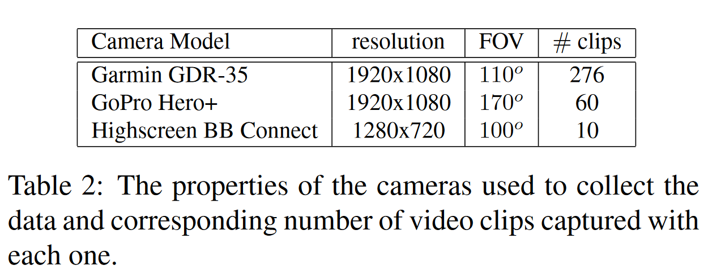

# JAAD paper summary

0730

精读论文，获取更深入的思考

## academic term

| English                                                      | Chinese                                          |
| ------------------------------------------------------------ | ------------------------------------------------ |
| understand intention of other road users                     |                                                  |
| visual and contextual info                                   | 视觉及语义情景信息                               |
| visual preception                                            |                                                  |
| scene understanding                                          | 场景理解，有点类似导盲                           |
| non-verbal communication                                     |                                                  |
| yield                                                        | 让步/让路                                        |
| take the right of way                                        | 辨别方位                                         |
| cross the street / Jaywalk                                   | 横穿马路                                         |
| perceptual discrepancy                                       | 感知差异（失灵）                                 |
| employ dynamic factors, such as trajectory or velocity       | 采用动态因素，如轨迹[3]或速度                    |
| spatiotemporal                                               | 时空的（高级词汇）                               |
| delineation                                                  | ！描述 【38】                                    |
| demographics                                                 | 人口统计(路人的特征)                             |
| push a stroller                                              | 推婴儿车                                         |
| occlusion informaion                                         | 阻塞信息                                         |
| optical flow                                                 | 光流！                                           |
| stereo information                                           | 立体信息                                         |
| pedestrians head orientation, the curbside location and distance and trajectory of the pedestrians. | 行人的头部方向，路边的位置以及行人的距离和轨迹。 |
| monocular                                                    | 单目的                                           |
| rear view mirror                                             | 后视镜                                           |
|                                                              |                                                  |
|                                                              |                                                  |
|                                                              |                                                  |
|                                                              |                                                  |
|                                                              |                                                  |
|                                                              |                                                  |
|                                                              |                                                  |
|                                                              |                                                  |
|                                                              |                                                  |

## Keywords

some useful pair to search related information

- Facial age estimation and gender classification 

classify: young, children, old, men, women, special activity, 

- Kitti's optical flow and stereo information for mapping and localization.

## Context Info

Understanding pedestrian activities and predicting their behavior in traffic scenes requires higher level reasoning by taking into account various contextual elements. 

- target specific:
  - demographics (e.g. gender and age) or 
  - culture specific attributes [39], 
- spatiotemporal (e.g. trajectory or velocity) [25] 
- environmental context (e.g. signs, delineation) [38].

### 数据收集的有价值信息

1. 相机参数，非常重要

   monocular

2. North America (60 clips) and Europe (286 clips)
3. 

## good reference

### in paper: before 2017

J. F. P. Kooij, N. Schneider, F. Flohr, and D. M. Gavrila. Context-based pedestrian path prediction. In ECCV, pages 618–633, 2014.

N. Lubbe and J. Davidsson. Drivers comfort boundaries in pedestrian crossings: A study in driver braking characteristics as a function of pedestrian walking speed. Safety Science, 75:100–106, 2015.

A. T. Schulz and R. Stiefelhagen. **Pedestrian intention recognition** using latent-dynamic conditional random fields. In Intelligent Vehicles Symposium (IV), pages 622–627, 2015.

A. Tom and M.-A. Grani ́ e. Gender differences in pedestrian rule compliance and visual search at signalized and unsignalized crossroads. Accident Analysis & Prevention, 43(5):1794–1801, 2011. 【38】

### after paper: till 2023