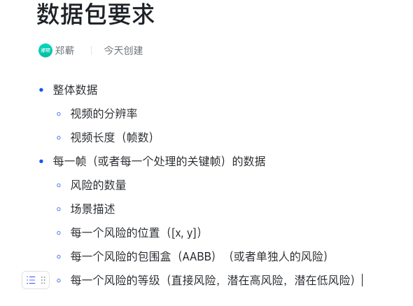

# 0805 周报

王杰

2023年8月5日

###### 总体来讲这是比较倒霉的一周，不过在各种折腾后有了前进方向，剩下的事情就是堆时间了

## 暑期培训

很充实的三天，接触了很多关于‘设计’的全新视角，感觉和专业人士的讲解有点触类旁通。不过也有很多课程/讲座是不太听的懂，应该花时间再温习巩固一下新知识。

### Pre

- 第一天的几个同学pre感觉都不是特别好，如同Dr. 王所说，pre的能力需要锻炼，我个人也有所生疏了
- 做的最好的还是汪芷琪学姐的，很文雅得体同时贯通，反向利用3D打印的脆弱性做可破坏性设计这点还蛮有趣的，有点取反之道的感觉，或许以后可以思考contradiction 的positive effect
- ZQ的demo简直是灾难级别的，在台下为他捏脸把汗，听的我很胃疼。有点自责自己没有跟他提前讲清楚，或者说‘画饼’画好，把愿景跟他沟通清楚后他或许会自信点，展示的效果也会好点。
  - 感觉他平常被打击的有点emo，语无伦次的想法是他或许是那种需要在上台前鼓励的类型
  - 我感觉他在周一上午月牙楼的ppt和思路其实比正式的好快，后面不知道为什么选择把信息集中到几张ppt讲解，但是他当时对整体框架理解并不透彻，估计是因为这样所以很不自信
- 易和阳学长的《dive into agent》超级棒！看的我激情澎湃，非常有深度而且有想法的综述，感觉之前的模糊想法得到验证并共鸣的感觉，加了他微信之后聊一下好了

### 专家讲座

>  腾讯超哥很实诚，本科也是ECE的，感觉会和他有共同语言

之前的讲座记录放在老电脑里，暂时不太记得了，不过对于当前下进度不是很重要，略过

### 自己pre的感受

有点类似新立哥的状态，莫名其妙push当组长后需要Pre。但是原本说一起pre, 可是正式开始时又很慌乱，缺乏事前分析

实际准备时长约4h，感觉做了很多工作，把自己讲嗨了，台下的同学却不太能get 到

- 碎碎念：组里的师兄师姐居然都没课上做作业，互动效果很差，还好潘老师解场（当时尬死我了）

有点悲伤，不过因为口齿不清的问题，pre一直不是我的强项

- Speaking English can partially get rid of my Mother tongue shame
- Practice makes perfect, 多听多学多说多练

希望下次类似场合能做的更好（向老师也可以再提点建议）

### 夜晚散步

收获很多的启发，希望未来能跟向老师约个时间私下喝咖啡聊聊以后的科研

- 个人感觉导师如果跟我关系处太好 不利于科研， 因为一定程度上需要被监督
  ***Semi-Supervised Learning***

（如果时间不匹配就等开学再聊！）

### 实验

感觉虽然组织有点混乱，但是这种整个lab一起做测试的感觉还蛮好的

- 类似网络不好的场合或许应该提前打印实验须知，和技术流程

- midjourney是好文明，以后继续学习文生图技术

## 周四 & 周五

### 电脑坏了

- 已送修，进度在云服务器上，无需担心
- 实验室电脑配了cuda，但是进一步安装wsl2的nvcc遇到了点问题
  - win10 程序可以完全使用3090了
  - linux程序还无法使用nvcc，结题前不考虑
  - 不要让非专业人士试着debug，可能会破坏环境（GPT-4跟我说要整个WSL2内核重装， 我有点小麻）
  - 下周找淘宝专业远程装机的看看

### 论文

如组会&飞书文档所示，稳健推进（画饼）中

问题：之后的在线协作怎么办

### 技术

- [ ] sam track 是好的，但是需要时间导出&实装
- [ ] 根据ZQ的需求（如下），导出数据包给他
- [x] 明天和学姐对一下进度

