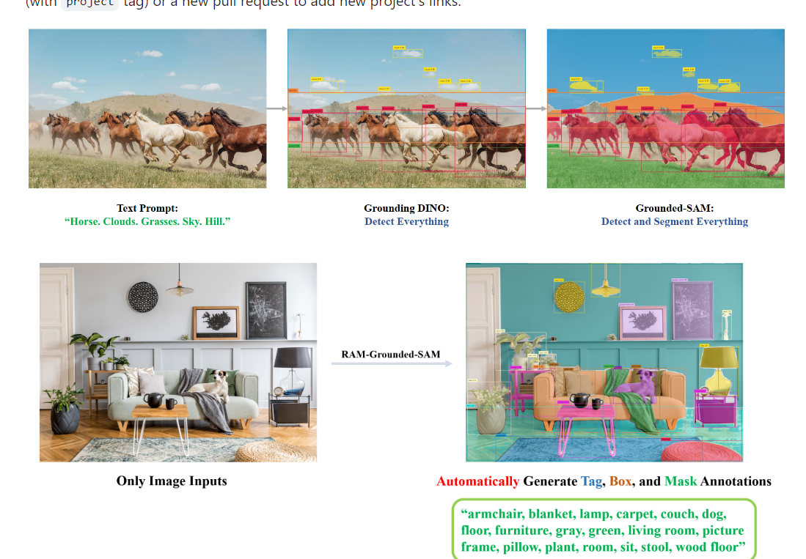
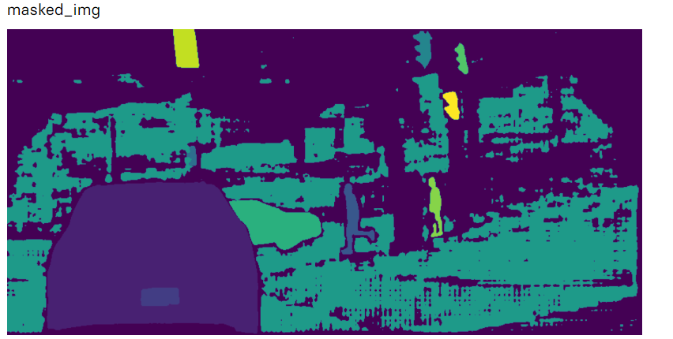
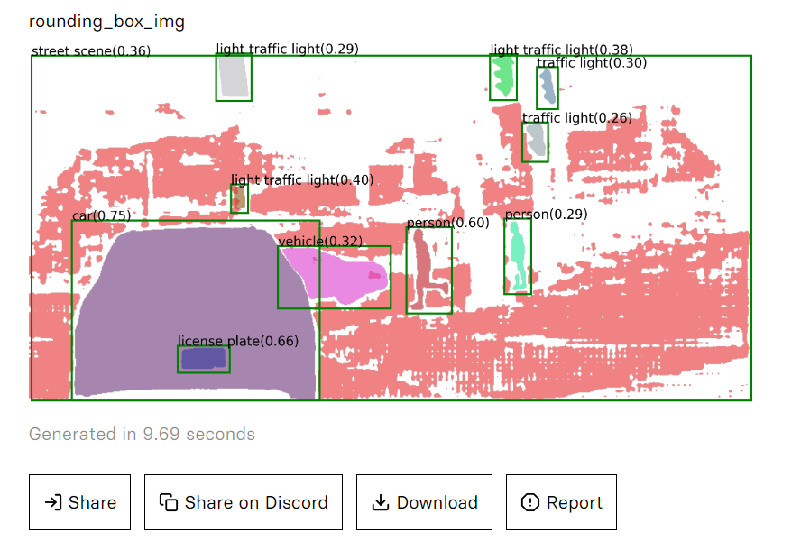
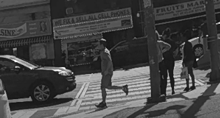
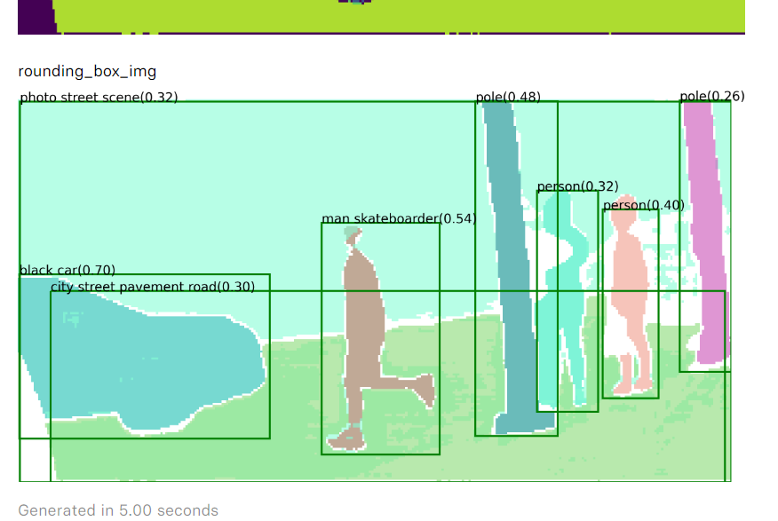
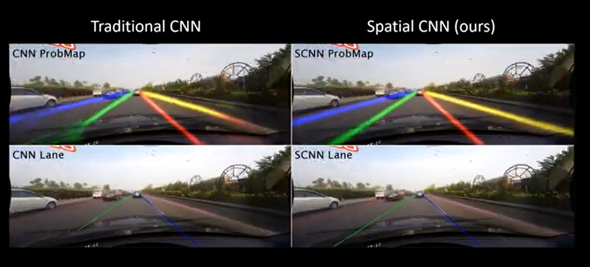
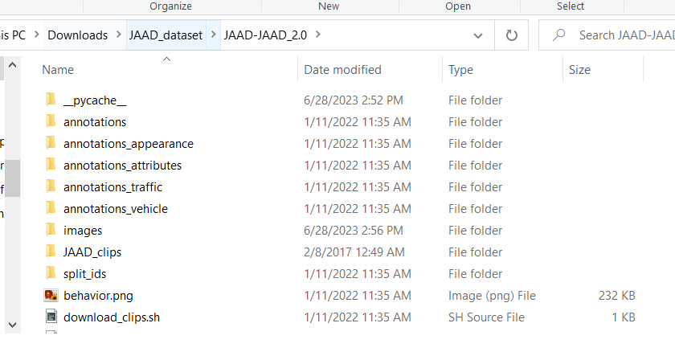

# Seg Any Product 0628

Considering time limit, I choose don't design pipeline completely on my own now. 

Instead, let us check some online demo model after SAM

## 1. Grounded Sam

This one can automatically detect everything and label them with text using just one image

原理图：



#### Output

tags

```
car, charge, city street, cross, drive, person, intersection, license plate, pedestrian, plug, road, stop light, traffic light, street corner, street scene, vehicle, walk, white
```

json_data # 这个似乎是别人提取SAM的结果，然后接个分类器效果还可以

```json
{
  "mask": [
    {
      "label": "background",
      "value": 0
    },
    {
      "box": [
        52.77540588378906,
        206.93600463867188,
        358.07781982421875,
        429.4527893066406
      ],
      "label": "car",
      "logit": 0.75,
      "value": 1
    },
    {
      "box": [
        183.0196533203125,
        361.88592529296875,
        247.27842712402344,
        395.47430419921875
      ],
      "label": "license plate",
      "logit": 0.66,
      "value": 2
    },
    {
      "box": [
        465.276123046875,
        215.4711151123047,
        521.6146850585938,
        322.0806884765625
      ],
      "label": "person",
      "logit": 0.6,
      "value": 3
    },
    {
      "box": [
        248.89840698242188,
        162.73281860351562,
        270.1543884277344,
        197.84718322753906
      ],
      "label": "light traffic light",
      "logit": 0.4,
      "value": 4
    },
    {
      "box": [
        568.7525634765625,
        2.0251846313476562,
        601.424072265625,
        58.90974044799805
      ],
      "label": "light traffic light",
      "logit": 0.38,
      "value": 5
    },
    {
      "box": [
        2.89654541015625,
        3.6640167236328125,
        891.031494140625,
        429.4510498046875
      ],
      "label": "street scene",
      "logit": 0.36,
      "value": 6
    },
    {
      "box": [
        307.04296875,
        238.720947265625,
        446.2754211425781,
        316.1839599609375
      ],
      "label": "vehicle",
      "logit": 0.32,
      "value": 7
    },
    {
      "box": [
        626.4829711914062,
        17.847070693969727,
        652.7698364257812,
        69.73944854736328
      ],
      "label": "traffic light",
      "logit": 0.3,
      "value": 8
    },
    {
      "box": [
        586.5097045898438,
        205.07485961914062,
        619.1061401367188,
        298.286376953125
      ],
      "label": "person",
      "logit": 0.29,
      "value": 9
    },
    {
      "box": [
        230.5131378173828,
        1.056589126586914,
        274.3091735839844,
        59.73011016845703
      ],
      "label": "light traffic light",
      "logit": 0.29,
      "value": 10
    },
    {
      "box": [
        608.4249877929688,
        86.26927185058594,
        640.627197265625,
        134.67056274414062
      ],
      "label": "traffic light",
      "logit": 0.26,
      "value": 11
    }
  ],
  "tags": "car, charge, city street, cross, drive, person, intersection, license plate, pedestrian, plug, road, stop light, traffic light, street corner, street scene, vehicle, walk, white"
}
```





https://replicate.com/idea-research/ram-grounded-sam

It seems failed to detect lane correctly, but other useless stuff(maybe we can prompt the SAM to detect lane? I am not sure)

Like, we use person feet( 人的碰撞箱下边框中间的点)as prompt point, detect the biggest bbox relationship

缩放后的效果，依然不能识别出路的分别，不过确实知道是pavement road(但不全是？)





## Traditional Approach on Lane-pedestrian relationship detection

我重新思考了一下我们的任务：分析人和路的关系，将视觉转化为文本

那么传统算法是如何实现这种分析的呢？我询问GPT后截取了有价值的回答

### Task: In the driving scenario, explain how does the traditional algorithm detect the relationship between pedestrian and the lane? 

For example, I want the ego car can detect if the pedestrian is walking across the zebra-crossing. Or maybe he is just standing by the sideroad and watch his phone. 

#### GPT:

> The traditional approach for lane-pedestrian relationship detection mainly involves the following steps:
>
> 1. **Pedestrian Detection**: 略，这个已经实现
>
> 2. **Lane Detection**: The next step is to detect lanes in the scene. Traditional computer vision methods for this often involve **edge detection** (like the Canny edge detection method), **color thresholding** (to isolate lane markings based on their color), and a **Hough transform** to detect the straight lines corresponding to the lanes. Alternatively, lanes can be detected using more complex methods like **semantic segmentation.**
>
> 3. **Relationship Detection**:  If the bounding box of a detected pedestrian **overlaps** with the detected lanes, then the pedestrian is considered to be in the lane. If the pedestrian is detected near the lanes but not overlapping, they may be considered as standing on the side of the road.
>
> ~~For the specific example of detecting whether a pedestrian is crossing the zebra crossing, the algorithm needs to not only detect the lanes but also specifically detect the zebra crossing. This could be done by looking for the characteristic pattern of the zebra crossing in the image.~~ 无用的片段

**Q：** SAM itself only has segmentation capabilities, and we want to calibrate the ground around the pedestrian on the basis of its segmentation to distinguish whether the pedestrian is on a lane or sidewalk

> Yes, you're correct. You can approach this by using SAM for two main segmentation tasks: 
>
> **Pedestrian Segmentation**: Train SAM on a dataset where pedestrians are annotated. This would allow the model to generate masks that identify pedestrians in new images. [略，不如使用已有算法]
>
> **Lane and Sidewalk Segmentation**: Similarly, train SAM on a dataset where lanes and sidewalks are annotated, which will allow it to generate masks that identify these areas in new images.

Once you've obtained the segmentation masks for pedestrians, lanes, and sidewalks, you can analyze these masks to determine whether a pedestrian is on a lane or a sidewalk. Specifically, you can perform a pixel-wise 'and' operation (intersection) between the pedestrian mask and the lane/sidewalk mask. // 这个思路可以用于实际编写代码时，如何将图片进行解析，一个AND 或许有不错的效果

If the intersection of the pedestrian mask with the lane mask has a substantial number of pixels, it can be inferred that the pedestrian is on the lane. Similarly, if the intersection of the pedestrian mask with the sidewalk mask has a substantial number of pixels, it can be inferred that the pedestrian is on the sidewalk. // 感觉在胡言乱语，不好判断，学姐觉得呢？

Note that this approach requires you to have a dataset where pedestrians, lanes, and sidewalks are annotated, so that you can train SAM for these segmentation tasks. Furthermore, the accuracy of the results will depend on how well SAM can perform these segmentation tasks, which in turn depends on factors like the quality and diversity of your training data, and the complexity of the scene (e.g., lighting conditions, occlusions, perspective distortion). 

这里我又仔细思考了一下，只需要distinguish 行车区域和行人区域就好，不需要太过specific 在 lane detection 这块，因此我询问相关成熟算法

**Q:My ultimate goal is to distinguish between pedestrian areas and driving areas, list some algorithm to do this task**

Sure, there are various ways to distinguish between pedestrian areas and driving areas. Here are a few methods:

1. **Semantic Segmentation Models:** These types of models (like the Segment Anything Model (SAM), U-Net, DeepLab v3, etc.) are designed to classify each pixel in an image, which would allow you to mark pedestrian areas and driving areas distinctly. These models require labeled training data where each pixel is assigned to a category like 'pedestrian area', 'driving area', etc.

    这个其实有点像是clip的思路，通过大量训练text+image的方式，使得图像和文本有correlation，但问题依然还是可能这些模型都不能理解什么叫道路

2. **Instance Segmentation Models:** These models (like Mask R-CNN) not only classify each pixel in an image but also differentiate between separate objects of the same class. This can be useful if you need to identify individual pedestrians or vehicles.

   听上去有意思

3. **Depth Estimation Models:** These models estimate the depth of each pixel in an image, which can help distinguish between areas close to the camera (typically the driving area) and areas further away (often pedestrian areas). Some depth estimation models are monocular (e.g., Monodepth2) and can work with a single camera, while others may require stereo cameras or LiDAR sensors.

   之前提到高精度地图，但是那是在GPS 领域的，和单个照片不同，需要lidar 和radar 等实现一个整体pipeline，非常复杂，不适用于我们现在希望做的architecture

4. **Traditional Computer Vision Techniques:** These include techniques like color-based segmentation (e.g., using HSV color space to differentiate roads from sidewalks), edge detection (to detect boundaries between driving and pedestrian areas), and perspective transformations (to focus on a certain area of the image).

   感觉实现比较容易，但是没想好怎么做

5. **Bird's Eye View Transformations:** Some methods first transform the image to a top-down "bird's eye" view, which can make it easier to distinguish between different areas. This often involves perspective transformations and may require calibration for different camera setups.

   ​	 这个思路不可行，单张图像转换成本太高昂了

6. **Object Detection Models:** Another approach is to detect specific objects (like pedestrians, vehicles, etc.) and then infer the driving and pedestrian areas based on these detections. Models like YOLO, SSD, or Faster R-CNN could be used for this.

咨询了一下之前lab的学长：

他朋友表示： [【论文解读】SCNN 车道线检测 - 知乎 (zhihu.com)](https://zhuanlan.zhihu.com/p/79524785)

SCNN，不过是5年前的工作了，感觉不够reliable?



## JAAD annotation

今天下午配置运行了一下他的脚本，官方的文档比较鸡肋，大部分情况得自己看注释去选择如何生成

具体内容我晚上再写一下 TODO



## IDEA: 在场景中重要的可能是curved line

上面这些传统算法我研究了一下，大多分析的是高速公路的连续交通线，然后在数据集里很多是那种城镇内的情况，甚至有时候无车道线

这种就比较复杂了

我有点迷茫，不知道也不应该继续这块的分析，因为好像和 “预测行人目的”这个初始任务偏离的有点远了（虽然是个COT，但感觉好像开始不搭边了）

希望和学姐聊一下分析这个事情

SAM的核心问题在于：虽然他分离出来各个色块，但其实还是需要我们人脑去分析哪个是路哪个是人怎么结合起来，分离出来的mask或许有助于模型去分析，但我们还是缺少一个可以将他转化成text的模型

因为我们无法确定line 和sideroad 的关系，这是比较困难的（毕竟是行车记录仪视角）

这里想到大模型能否判断呢？人类判断马路的方式是什么？纯经验调度还是有迹可寻呢


