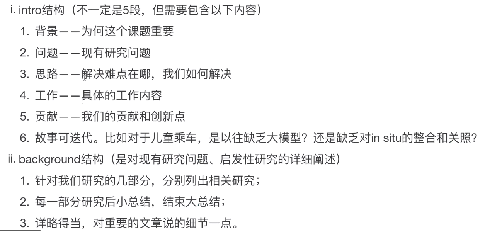
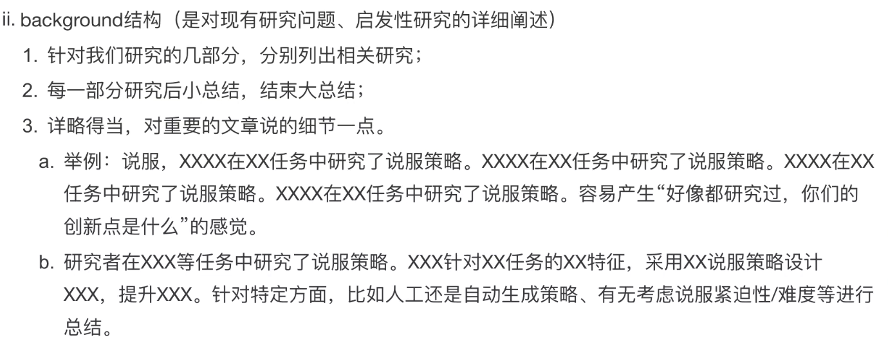
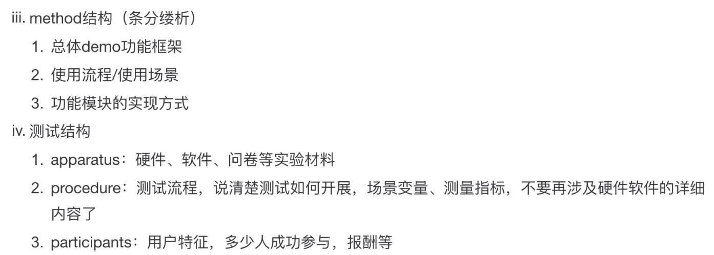
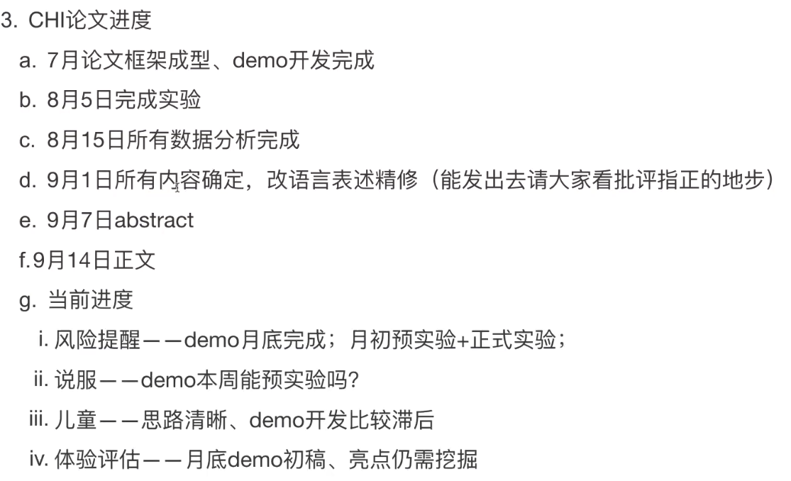

# 0725 组会记录

2023年7月25日

## Custom Instruction

my task, 略

## CHI Paper Architecture

1. 论文outline: intro,, background, method, result

2. demo: zhendui 

   1. 详略得当，专注核心功能和优势

      1. 合适的assumption 和简化：设计不会增加方案

         例子：配眼镜店用的支架托下巴固定机位

      2. 眼动：几个区域的自适应识别，有必要实现吗

      3. 说服：考虑环境状态判断是否需要说服

   2. 核心功能做深入

      1. 有一定难度和工作量（门槛），solution to unsolved problem

   3. 测试验证

      1. 测试类型：
         1. 实验室环境试验，有demo, 30-50人
         2. 真实场景：或许20人
         3. 变量设定覆盖demo功能
      2. 测试指标
         1. 针对demo功能设计测量指标，如风险提醒是否意识到all 风险
         2. 丰富一些，多角度记录用户状态，行为改变。客观认知+主观体验+可能生理指标
         3. 测量方式：标准化，随机测试
         4. 记得知情同意书
      3. 延时性：不考虑！可以提前处理好数据，做实验时提前准备好！！！！
         - 太棒了，i了
         - GPT也提前输出好哼哼
      4. 

3. 论文写作

试验伦理学

Intro background method 都可以写了，result 和discussion之后写

写作原则：

- 表意清楚为要，不要让人去猜

- 一段话一个主题，方程解耦，
- 每一章节，每一段话，总分结构/分总结构，简单明了即可
  - 否则容易迷失，需要使评审在15MIN内扫完并发现亮眼的创新

## CHI 论文进度schedule

## dataset

多样化的提供，甚至可以自己拍视频，还有截取网上的第一视角视频

## 推进时提根弦

遇到不对劲的时候，就立刻汇报沟通

免得推进的时候进入local minimum -> "滑过去的小问题会变成大Bug"

如果很顺很顺，说明工作没有门槛->要么没价值，要么有人做了

- 投出去之后有大坑没注意到的可能性【非注意力盲视】

研究一下COT:

[‍⁣‌‌‍‬⁣‬‌⁢⁢⁤⁡⁣⁢⁤‍⁤⁤⁤⁤‍‌⁤‍⁣⁢⁣⁢⁤⁡无案例版本 - 飞书云文档 (feishu.cn)](https://rsqru0jda7.feishu.cn/wiki/WoVfwH3kjicjvVkHkdCcPeUCnEh)

## TODO LIST:

- [ ] 继续做object  track 并加入信息里
  - [ ] 另外一个单独的模型做，然后把他的输出导入，对齐不同帧的人的名称
  - [ ] 用rule的方式对其路的名称，或者干脆叫近端路，远端路
- [ ] HP: 暗夜精灵修复
  - [x] confirm buyer & IT schedule 
  - [ ] 工具箱
  - [ ] 检查应用
- [ ] 试验环境搭建
  - [ ] 重新建立黑盒，放驾驶方向盘等
  - [ ] 托下巴的固定器
  - [ ] 显示屏和定位器
  - [ ] 或许需要支架
- [ ] 提前跑数据，demo跑通后狠狠算数据，崩内核就反复重启跑
  - [ ] 输出成text mode之后交给llm分析
  - [ ] 视频标定
  - [ ] JAAD 导入?
  - [ ] 自己测的数据导入
- [ ] ground truch benchmark是什么
  - [ ] JAAD 的标记一定要搞定了，学会用他的api
  - [ ] 读读论文