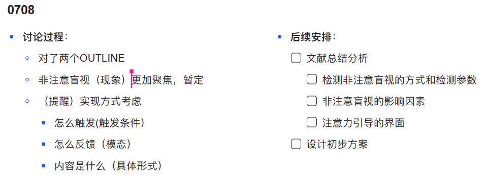

# Paper Meeting: Inattentional blindness

07/08/2023

- 情景意识/态势感知：识别，理解，预测‘

- 反馈如何设计：触发形式，反馈模态，模态类型

- 解决方案的深化，集中一个点，更好的效果或者更有新意

> *Disclaimer: I learned really little about HCI. As a layman, my suggestion is lack of solid theory foundation in related area.*

## My idea on the Connection between Inattentional Blindness(IB) and LLM

The idea of IB is innovative and important, which is quite hard to be decided by traditional algorithm. It seems to be kind of NP-hard problem for those methods without "common sense". 

While I believe, LLM, as the reflection of human intelligence, can partially contributes to the solution of IB decision problem. 

### Intuitive engineering idea 

- First intuition is to test some cases where the IB happen, and see if the LLM can judge the problem. Maybe we need a basic demo of question set from other cases other than driving. I believe there do exist some data set in psychology field, which requires further literature review. 

-  Unlike other careless problem, IB is more ambiguous and interesting, the driver usually won't tend to admit that they have their mind wandered while driving. This makes it hard to have the correct reflection. Maybe we need to find a good matric first, evaluating the real status of driver. As an engineering student, I would suggest to use some detailed statistic data for precise quantification. For instance, we have:

  - **Eye movement / focusing area,** maybe if the driver is absent-minded, the pupil(瞳孔) will behaves differently, and the eye-tracking method can also provide some insight idea. Which can be transformed into text modality and send to LLM. 
    - data coming from in-car camera
  - **Heart rate** maybe when the driver is IB, his heart rate will stay low and relaxed, which may lower his alertness on the outside environment
    - data coming from smart watch 
  - **Position of hand **, here the second job may not only be picking up the phone. The driver may have many petty actions when IB. For example, picking ears, scratching head, driving water.... All those easy job, but can get them distracted. 
    - data coming from in-car camera
  - **Area Information** if the driver is in the daily routine which he is familiar with, he will always tend to feel more confident and get into IB
  - .... other modality that is easy to be transformed into TEXT

  

  ## The ability of LLM 

  When I said "LLM's main functionality is to generate", I mean, the basic idea of current LLM is just to imitate the speaking ability of human. It is powerful, but will never be AGI, which is still quite far from current era. 

  The learning ability of LLM comes from text data, while we currently don't have visual-GPT

  4( which maybe release later), we can't turn image data into text data easily. The "manual transformation" step creates a lot of data loss. The rule-based perception can never achieve same visual understanding of human, while we can still use current LLM to *generate some interesting output* for the interactive task. 

  Maybe we need to think: if our vision model can only deal with middle-far range data, then how should our LLM use the time gap? Maybe he can generate some effective and practical output, not just the alert to dangerous scenario. 

  As for my understanding on our project,   I think the valuable point is to discover “ potential / latent risk" in the road. 

  

  

 